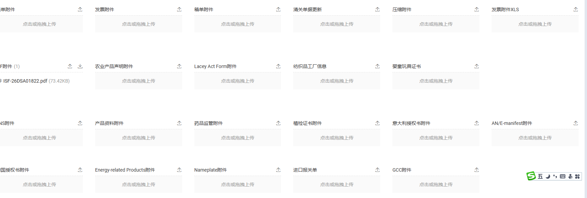

# Logixs 需求迭代

# 两个业务

流程可以明确分成两个业务域：出运前履约准备，以及出运后在途与到港生命周期。

当前项目应以后者为核心，前者只保留稳定的上游引用和扩展接口。

**一、完整业务链路**

```Plain Text
采购计划
  -> 采购
  -> 按国别制定出运计划
  -> 确定 SKU 与计划总量
  -> 按目的港 + 仓库分仓
  -> 按供应商 + 起运港规划装柜
  -> 整柜 / 多供应商拼柜
  -> 生成并发送备货单
  -> 供应商备货
  -> 提空箱
  -> 装箱
  -> 关联集装箱与备货单
  -> 补充出运资料
  -> 实际出运
  -> 在途跟踪
  -> 到港、清关、提柜、还箱、入仓等后续生命周期
```

需要纠正一个容易固化错误模型的表述：“一柜一个备货单、一柜多个备货单”说明集装箱和备货单不是一对一，而是多对多关系：

- 一个集装箱可以装多个供应商的多个备货单。

- 一个备货单也可能因数量、体积或分批出运被拆到多个集装箱。

- 关联关系还必须记录本柜实际装载的 SKU、数量、体积、重量等。

因此不能在集装箱表中只放一个 `stockingOrderId`。

**二、当前项目的业务边界**

当前系统的流程起点建议定义为：

> 已实际出运，并且能够确认一次出运事实及其货物、航线和集装箱信息。

“已创建订舱”“预计开船”“已经装箱”都不等于已出运。当前导入起点应至少满足以下一种条件：

- 存在实际离港时间 `ATD`；

- 来源系统明确给出稳定的 `DEPARTED` 状态；

- 经有权限的业务人员确认已出运。

当前系统负责：

- 导入和校验已出运数据；

- 建立出运、集装箱、货物之间的权威关系；

- 跟踪船期、节点、异常和资料；

- 管理到港、清关、提柜、还箱、入仓等生命周期；

- 保留完整来源、变更和审计记录。

当前系统暂不负责：

- 计算国别需求和出运计划；

- 分仓优化；

- 供应商组合与整柜/拼柜优化；

- 生成或下发备货单；

- 提空箱和现场装箱作业。

这些上游对象现在可以被引用，但不应提前实现空壳状态机或虚构业务规则。

**三、不要只设计“一张大表”**

业务上可以称为“稳定的出运数据结构”，但数据库不宜是一张包含所有内容的宽表。出运、集装箱、SKU 明细和生命周期事件具有不同粒度：

如果当前来源确实只有一柜一票，也仍应保留这些边界，不要把来源文件的偶然结构变成永久领域约束。

**四、****`shipments`**** 应保存的稳定事实**

建议出运主表只保存出运级字段：

- 内部稳定 ID；

- 业务出运号；

- 来源系统、来源记录 ID、来源版本；

- 运输方式；

- 船公司、船名、航次；

- 主提单号、分提单号；

- 起运国、起运港；

- 目的国、目的港；

- 最终目的仓或交付地；

- 预计/实际离港时间 `ETD/ATD`；

- 预计/实际到港时间 `ETA/ATA`；

- 当前生命周期状态；

- 状态版本或并发版本；

- 导入批次、首次导入和最后更新时间；

- 创建人、修改人及审计信息。

时间应当是带语义的独立字段，不能只放一个模糊的“出运日期”。数据库保存 UTC；交换使用 ISO 8601；展示时转换到业务时区。

以下内容不应直接堆进主表：

- 多个集装箱号；

- 多个 SKU；

- 多个供应商；

- 多个备货单号；

- 事件历史；

- 文件列表；

- 用文本拼接的港口、仓库或状态说明。

**五、上游预留接口**

建议采用“引用而非复制规则”的方式预留：

- `sourceShippingPlanId`：上游出运计划引用；

- `sourceStockingOrderId`：备货单引用；

- `sourcePackingOrderId`：装箱任务引用；

- `sourcePurchaseOrderId`：采购订单引用；

- `sourceSystem` \+ `sourceRecordId`：通用外部身份；

- 可选 `upstream_references` 关系表：支持一个对象关联多个上游单据。

这些字段当前可以为空。将来接入备货平台时，由适配器把上游模型映射成当前系统的正式契约，不能让供应商平台的数据结构直接进入领域模型。

**六、导入已出运数据的必要能力**

导入不是简单地把 Excel 行写入数据库，至少需要：

1. 上传后先预检，不立即落入正式业务表。

2. 明确列级和行级错误，非法港口、时间、数量、箱号不得静默替换。

3. 以来源系统和来源记录 ID 做幂等；没有来源 ID 时使用经过定义的业务组合键。

4. 同一出运的多行 SKU、多个柜必须正确归组。

5. 整批正式导入使用事务，避免只落入一半关系。

6. 重复导入应区分完全重复、允许更新和业务冲突。

7. 保留原始文件、批次摘要、逐行结果和操作人。

8. 已进入生命周期后的关键事实更新要形成变更记录，不能覆盖历史。

9. 同一箱号出现在不兼容的活动出运中时必须报冲突。

10. 导入完成后给出新增、更新、重复、失败及需人工处理的明确结果。

**七、生命周期建议**

出运状态不应试图替代所有事件。建议：

```Plain Text
DEPARTED
  -> IN_TRANSIT
  -> ARRIVED
  -> CUSTOMS_CLEARANCE
  -> RELEASED
  -> PICKED_UP
  -> DELIVERED_TO_WAREHOUSE
  -> EMPTY_RETURNED
  -> CLOSED
```

异常如甩柜、延误、查验、滞箱、改单，应记录为事件或异常案件，不宜随意扩展成互斥主状态。系统的“当前状态”是事件投影出的便捷结果，事件记录才是可审计事实。

不同集装箱可能在不同时间提柜、还箱，所以出运级状态和箱级状态必须分开。只有定义了明确聚合规则，才能从多个箱状态计算整票出运状态。

**八、当前阶段的最小可交付闭环**

目标岗位需要能够：

- 导入已出运货物数据；

- 在提交前发现重复、缺字段和业务冲突；

- 查看一票出运下的柜、SKU、数量、目的仓和关键时间；

- 识别当前阶段、逾期节点和资料缺口；

- 录入或接收后续事件；

- 查看事件历史和修改来源；

- 确认最终到仓、还箱并关闭出运。

这才构成当前“出运后生命周期”的闭环。仅有一张出运表和一个导入接口，还不足以称为生命周期管理。

下一步应结合仓库现有 schema、导入模板和状态定义，形成一份“现状与目标模型差异清单”，再决定是扩展现有模型还是追加迁移。当前尚未对项目实际实现完成这一步核对。

## 出运后核心边界与现状/目标模型差异

已完成“”评审稿，结论是：**当前数据库还不符合新的产品边界，暂时不应直接迁移。**

核心结论：

- 新增独立 `Shipment` 聚合。

- Shipment、货柜、出运货物、运输单证分别建模，禁止宽表堆叠。

- 保留现有柜级 `FlowInstance`，新增 `post_departure` 流程配置，避免生成备货、装箱等上游空壳节点。

- 复用

-

-

- 用独立 `ShipmentCargoLine`，补充件数、重量、体积。

- MBL/HBL 使用独立运输单证表。真实样本证明一张 MBL 下有 4 张 HBL，不能保存为单值字段。

- 备货单、采购单、出运计划和装箱任务只作为上游引用。

- 当前按备货单分组、取首个箱号、创建 `not_shipped` 柜并初始化 14 节点 Flow 的导入实现已明确登记为目标差异。

- 真实样本缺少 ATD 精确时刻和 UTC 偏移，“已出运”来源权威也尚未批准，因此现在只能用于草稿归组和货物对账，不能伪造成正式离港事件。

主要评审文件：

- \[出运后核心模型差异 V1 \(line 16\)\]\(/D:/Logixs/docs/product/domain/POST\_DEPARTURE\_CORE\_MODEL\_GAP\_V1\.md:16\)

- \[候选物理模型 \(line 98\)\]\(/D:/Logixs/docs/product/domain/POST\_DEPARTURE\_CORE\_MODEL\_GAP\_V1\.md:98\)

- \[真实样本目标投影 \(line 143\)\]\(/D:/Logixs/docs/product/domain/POST\_DEPARTURE\_CORE\_MODEL\_GAP\_V1\.md:143\)

- \[导入十项能力差异 \(line 161\)\]\(/D:/Logixs/docs/product/domain/POST\_DEPARTURE\_CORE\_MODEL\_GAP\_V1\.md:161\)

- \[迁移门禁 \(line 178\)\]\(/D:/Logixs/docs/product/domain/POST\_DEPARTURE\_CORE\_MODEL\_GAP\_V1\.md:178\)

同时已更新 \[出运流程权威 \(line 1\)\]\(/D:/Logixs/docs/product/domain/SHIPMENT\_FLOW\_OVERVIEW\.md:1\)、\[上下文边界 \(line 1\)\]\(/D:/Logixs/docs/product/domain/CONTEXT\_MAP\.md:1\)、\[导入模型 \(line 1\)\]\(/D:/Logixs/docs/product/domain/IMPORT\_DOMAIN\_MODEL\.md:1\)、\[数据库统一契约入口 \(line 46\)\]\(/D:/Logixs/docs/architecture/DATABASE\_SCHEMA\_CONTRACT\_V1\.md:46\) 和当前 \[备货工作台任务 \(line 8\)\]\(/D:/Logixs/docs/planning/tasks/p6\-cargo\-ready\-human\-centered\-redesign\.md:8\)。

验证通过：目标文档 Prettier、`pnpm repo:check`、`git diff --check`。未修改 Prisma、迁移或数据库；原有未提交工作台代码完整保留。

下一步应先评审 Shipment 粒度、柜侧活动基数、事件主体和 `post_departure` 流程原子性，批准后再形成公共契约及加法迁移设计。

# 四张表

基于 4 张维护表和 10 张详情表，建议把“货柜清关物流状态详情”定义为只读聚合视图，而不是第五张业务表。四张源表之间也不应继续互相读取、再写回；应改为各业务域维护自己的权威事实，由系统实时投影详情。

样本存在一个技术问题：工作簿将有效范围错误声明为 `A1`，普通导入工具可能只读取首格；正式导入器需要按实际 XML 单元格范围解析或要求来源重新规范导出。

**样本结论**

- 四张主表各有 20 条货柜，备货单号、柜号、提单号目前都是一一对应。

- 这只能说明本批样本如此，不能据此设计“一备货单一柜”约束。

- 20 柜均有出运日期、ETA、船名航次、起运港、目的港、箱型、重量、体积和金额。

- 20 柜物流状态均为“已出运”，清关状态均为“未清关”，ISF 均为“已申报”。

- 仓库、提柜、送仓、卸柜、还箱等字段大部分为空，符合“刚出运、尚未到港”的生命周期阶段。

- 10 张详情表每张只有一条记录、约 97 列，是从货柜、清关、物流、仓库四个维度拼成的快照。

- `销往国家` 实际保存的是 `AOSOM LLC`，属于公司/收货主体，不是国家代码，字段语义错误。

- 物流表的 `ETA修正` 出现 Java 对象字符串，例如 `[Ljava.lang.Object;@...`，属于明确的数据质量缺陷。

货柜、航次与装载基础字段来自货柜信息表 引出列表\_货柜信息表\_0923092212\.xlsx；清关和单证字段来自清关信息表 引出列表\_清关信息表\_0923092240\.xlsx；到港后计划与实际节点来自物流及仓库信息表 引出列表\_物流信息表\_0923092155\.xlsx 引出列表\_仓库信息表\_0923092259\.xlsx。

**建议的数据主轴**

```Plain Text
出运计划（未来）
  -> 出运 Shipment
  -> 备货单 ReplenishmentOrder
  -> SKU 明细
  -> 装载分配 ContainerCargoAllocation
  -> 货柜 Container
  -> 海运航段 / 清关案件 / 内陆运输 / 仓库交付
  -> 卸柜 / 还空箱 / 关闭
```

核心基数必须支持：

```Plain Text
Shipment 1:N Container
ReplenishmentOrder N:M Container
ReplenishmentOrderLine N:M Container
Shipment 1:N BillOfLading
Container N:M BillOfLading
Container 1:N LifecycleEvent
```

**合理字段切片**

**时间字段的正确建模**

现表把时间横向铺成大量列。目标模型应将“时间语义”和“生命周期事件”分开：

```Plain Text
nodeCode: destination_arrival
timeKind: planned | estimated | actual | deadline
occurredAtUtc
sourceTimezone
sourceSystem
evidenceRef
verificationState
```

必须保留的时间类别包括：

- 出运：计划出运、实际装船、实际离港；

- 海运：原始 ETA、修正 ETA、途经港到达、目的港到达、卸船；

- 清关：计划清关、申报、查验、放行；

- 提柜：最晚提柜、计划提柜、实际提柜；

- 送仓：最晚送仓、计划送仓、实际送仓/入仓；

- 卸柜：最晚卸柜、计划卸柜、实际卸空；

- 还箱：最晚还箱、计划还箱、实际还箱。

`预计到港日期` 和 `ETA修正` 不应互相覆盖，而应成为两个带来源和版本的 estimated 事实。

**状态切片**

目前的“备货单状态、物流状态、清关状态、单据状态、换单状态、WMS 状态”不能合并成一个大状态。建议分别维护：

- Shipment：已建档、已出运、在途、到港、已完成；

- Container：已装箱、已装船、在途、到港、已提柜、已送仓、已卸空、已还箱；

- CustomsCase：待资料、待申报、申报中、查验/扣留、已放行；

- DocumentPackage：缺失、部分齐全、已齐全、已发送、已核验；

- InlandMove：待计划、已计划、已提柜、运输中、已交付；

- WarehouseReceipt：待预约、待收货、已入仓、已卸空。

详情页展示这些状态的组合，不新增一个人工维护的“综合状态”。

**单证处理**

当前清关表为每类文件设置一个附件列和一个“是否传递”列，会持续膨胀。应统一为：

```Plain Text
document_record
- documentType
- subjectType / subjectId
- fileRef
- version
- transmissionState
- generatedAt
- sentAt
- receivedAt
- verifiedAt
- supersedesDocumentId
```

提单、箱单、发票、ENS、产品资料、植检、Lacey Act、药监、玩具证书、纺织厂信息、Energy\-related Products、Nameplate 都作为 `documentType`，不再新增数据库列。



**当前导入最小必填**

这批“已出运数据”进入系统时至少应要求：

- 来源记录 ID；

- 备货单号；

- 柜号；

- 箱型；

- 提单身份；

- 船公司、船名、航次；

- 起运港、目的港、目的国家；

- 实际出运时间及来源时区；

- ETA；

- 最终仓库组；

- 件数、体积、毛重；

- 至少一条 SKU 装载明细；

- 来源系统、文件批次和行号。

缺少 SKU 明细时，可以先建立“待货物明细补全”的已出运货柜，但不能把件数、重量或金额反推成 SKU 数量。

最终，“货柜清关物流状态详情”应成为按柜实时查询的 `container_operational_view`：它聚合出运、货柜、路线、清关、内陆、仓库、文件和事件事实，只读展示，不再回写四张业务表。

我要把4张表的字段作为项目的最小字段集，并保留后期可扩展与新增的弹性

会把这项要求落成项目中的正式设计基线：四张样本表的业务字段组成 V1 最小字段全集，但不会做成一张宽表，而是按出运、货柜、清关、物流、仓库、文件、时间事实和审计分层保存；新增字段通过正式扩展机制进入，避免 `JSON` 变成无约束杂物箱。由于这是业务、数据和公共契约方向的变更，我先使用 `logix-task-bootstrap` 定位应更新的权威文档和现有 brief，再决定本轮最窄落地范围。

要求先确认是否与已接受架构或正在进行的任务冲突。这里最关键的边界是：四张表定义“字段覆盖下限”，不等于四张表定义数据库表结构，也不等于所有字段首日必填；我会把“字段存在、字段可空、字段何时必填”拆开定义。

# 出运工作台与装箱工作台、备货工作台的当前数据交接方式最佳是什么？

最佳方式不是三个工作台共用一张宽表，也不是相互回写各自的数据表，而是采用：

> 稳定业务身份 \+ 版本化交接快照 \+ 明确交接事件 \+ 接收方对账确认

当前阶段，备货和装箱平台尚未正式建设，因此先用同一套交接契约的 Excel 导入适配器；将来替换为 API/Event 接入时，不改变出运工作台内部模型。

**推荐链路**

```Plain Text
备货工作台
  形成“备货完成快照”
       ↓
装箱工作台
  形成“实际装载完成快照”
       ↓
出运工作台
  接收“已出运交接包”
       ↓
出运后生命周期
  在途 → 到港 → 清关 → 提柜 → 送仓 → 卸柜 → 还箱
```

## 三个平台分别拥有什么

每项事实只能有一个权威所有者。下游可以保存交接时的不可变快照，但不能反向修改上游事实。

## 备货到装箱的交接

交接粒度应是“备货单行”，而不是只有备货单表头：

```Plain Text
ReplenishmentReadySnapshot
- snapshotId
- version
- replenishmentOrderId
- orderNumber
- supplierId
- originPortCode
- destinationCountryCode
- destinationPortCode
- destinationWarehouseId
- lines[]
  - replenishmentOrderLineId
  - productSkuId
  - plannedQuantity
  - readyQuantity
  - quantityUnit
- completedAt
- evidenceRefs
- sourceSystem
- idempotencyKey
```

装箱工作台只能从已交接的备货数量中分配实际装载量，不得修改备货单原始数量。

## 装箱到出运的交接

装箱工作台输出版本化的实际装载快照：

```Plain Text
ContainerStuffingSnapshot
- snapshotId
- version
- containerId
- containerNumber
- containerTypeCode
- sealNumber
- packageCount
- grossWeight + unit
- netWeight + unit
- volume + unit
- vgmWeight + unit
- allocations[]
  - replenishmentOrderLineId
  - productSkuId
  - loadedQuantity
  - quantityUnit
- stuffedAt
- evidenceRefs
- supersedesSnapshotId
- idempotencyKey
```

这能同时支持：

- 一柜一个备货单；

- 一柜多个备货单；

- 一个备货单拆入多个柜；

- 装箱结果更正但不覆盖历史。

## 出运工作台的正式入口

出运工作台不应只接收“柜号”，而应接收一个完整的已出运交接包：

```Plain Text
ShipmentDispatchHandoff
- handoffId
- shipmentId / sourceShipmentId
- sourceSystem
- carrierCode
- vesselName
- voyageNumber
- bookingNumber
- billsOfLading[]
- originPortCode
- destinationPortCode
- destinationCountryCode
- destinationWarehouseId
- actualLoadedAt
- actualDepartedAt
- containers[]
  - containerId
  - containerNumber
  - stuffingSnapshotId
  - stuffingSnapshotVersion
- documentRefs[]
- evidenceRefs[]
- idempotencyKey
- occurredAt
```

接收成功后，出运工作台建立：

```Plain Text
Shipment
  -> ShipmentContainer
  -> Container
  -> ContainerCargoAllocation
  -> LifecycleDateFact / CanonicalEvent
```

只有 `actualDepartedAt` 或其他符合权威规则的离港证据通过校验，才能进入“已出运”起点。只有装船证据、没有实际离港证据时，应显示为“已装船待离港”，不能混为已出运。

## 当前项目最合适的接入方式

现阶段使用“文件适配器 \+ 预检确认”：

```Plain Text
四张 Excel 表
  -> 原始文件留存
  -> 字段映射
  -> 按来源出运身份、柜号、备货单行归组
  -> 预检
  -> 人工复核
  -> 生成 ShipmentDispatchHandoff
  -> 调用统一出运接收用例
  -> 对账结果
```

将来切换为：

```Plain Text
备货/装箱平台 API 或事件
  -> 同一个 ShipmentDispatchHandoff
  -> 同一个出运接收用例
```

Excel 导入和未来系统直连只是不同 Adapter，不能各自写一套业务逻辑。

## 交接状态

建议每次交接独立记录状态：

```Plain Text
draft
-> submitted
-> validating
-> accepted
或 rejected / review_required
-> superseded
```

接收方必须返回：

- 接收成功的 Shipment、Container ID；

- 重复交接；

- 字段缺失；

- 数量不平；

- 柜号冲突；

- 快照版本过期；

- 出运证据不足；

- 需要人工复核的具体原因。

不能只返回“导入成功”。

## 最重要的对账规则

- 各柜装载量合计不得超过备货单行可交接数量。

- 同一装箱快照版本只能对应同一组装载内容。

- 已出运后不能无审计地替换柜号或装载关系。

- Shipment 下所有柜不必永远共用同一航次，甩柜或改船后允许柜级路线分化。

- 备货数量、装载数量、出运数量分别保存，禁止互相覆盖。

- 计划、预计、实际时间分别保存。

- 详情页是多个权威事实的投影，不得作为反向写入源。

- 所有交接必须带来源系统、外部 ID、版本、幂等键和证据引用。

因此，当前最佳方案可以概括为：

> 先定义统一的“已出运交接契约”，现在由四表导入生成它；未来由备货和装箱平台直接提交它。三个工作台通过版本化业务快照交接，不共享数据库，不互相回写，也不以详情宽表作为事实来源。

明确。当前项目应把业务边界固定为：

```Plain Text
当前：外部已出运数据导入 -> 出运接收边界 -> 出运后生命周期
未来：装箱平台完成装箱 -> 出运接收边界 -> 出运后生命周期
```

关键是当前导入和未来正常流程必须经过同一个应用入口，不能让导入直接写业务表，也不能将来再开发另一套“装箱转出运”逻辑。

**推荐架构**

```Plain Text
当前 Excel 四表
    ↓ Import Adapter
标准出运交接命令
    ↓
Shipment Intake Application Service
    ↓
Shipment / Container / Cargo / Document / Lifecycle

未来装箱平台
    ↓ Packing Adapter / API / Event Consumer
标准出运交接命令
    ↓
同一个 Shipment Intake Application Service
```

# 数据导入与直连接口

当前项目采购、出运计划、备货、装箱这几个环节还没有进入开发，直接从出运环节开始，数据要采用导入的方式，后期会通过正常流程从装箱环节流下来，这个机制与接口要设计好无缝切换衔接

## 统一入口

建议定义稳定公共端口：

```Plain Text
interface AcceptShipmentHandoffPort {
  preflight(command: ShipmentHandoffCommand): Promise<PreflightResult>;
  accept(command: ShipmentHandoffCommand): Promise<ShipmentHandoffResult>;
}
```

当前 Excel 导入模块只负责：

- 解析四张表；

- 按柜号、备货单号、提单号归组；

- 将外部字段映射成标准字段；

- 保留原始文件、批次和来源行；

- 生成 `ShipmentHandoffCommand`；

- 调用统一接收端口。

它不能直接调用 Prisma Repository 写 `Shipment`、`Container` 或生命周期表。

## 标准交接契约

```Plain Text
interface ShipmentHandoffCommand {
  contractVersion: "shipment-handoff.v1";

  tenantId: string;
  source: {
    channel: "file_import" | "packing_platform" | "api";
    system: string;
    externalHandoffId: string;
    occurredAt: string;
    idempotencyKey: string;
    sourceBatchId?: string;
  };

  shipment: {
    externalShipmentId?: string;
    shipmentNumber?: string;
    destinationCountryCode: string;
    originPortCode: string;
    destinationPortCode: string;
    destinationWarehouseId?: string;
    carrierCode: string;
    vesselName: string;
    voyageNumber: string;
    bookingNumber?: string;
    actualLoadedAt?: string;
    actualDepartedAt: string;
    estimatedArrivalAt?: string;
    tradeTerm?: string;
  };

  billsOfLading: BillOfLadingInput[];
  containers: ShipmentContainerInput[];
  documents: DocumentReferenceInput[];
  upstreamReferences: UpstreamReferenceInput[];
  evidence: EvidenceReferenceInput[];
}
```

每个柜包含四表最小字段集对应的数据：

```Plain Text
interface ShipmentContainerInput {
  externalContainerId?: string;
  containerNumber: string;
  containerTypeCode: string;
  sealNumber?: string;

  packageCount?: number;
  grossWeight?: DecimalValue;
  volume?: DecimalValue;

  replenishmentOrders: ReplenishmentOrderReference[];
  cargoAllocations?: CargoAllocationInput[];

  customs?: CustomsHandoffInput;
  inlandPlan?: InlandPlanInput;
  warehousePlan?: WarehousePlanInput;
  lifecycleFacts: LifecycleFactInput[];
  attributes?: ControlledAttributeInput[];
}
```

## 当前与未来的字段差异

统一契约不等于所有来源必须提供全部字段。

因此应把字段分成三类：

- `requiredAtShipmentIntake`：进入出运流程必须存在；

- `requiredWhenSourceIsPackingPlatform`：未来装箱平台交接时必须存在；

- `optionalOrLateBound`：允许后续节点补充。

不能因为未来会有更多字段，就阻止当前四表导入；也不能因为当前缺少 SKU 明细，就永久降低未来正常流程的完整性要求。

## 出运接收后的原子操作

统一服务应在一个业务事务中完成：

1. 校验契约版本和来源身份。

2. 执行幂等检查。

3. 匹配或创建 `Shipment`。

4. 匹配或创建 `ContainerRecord`。

5. 建立 `ShipmentContainer`。

6. 保存备货单和上游引用。

7. 保存可获得的货物汇总或 SKU 装载分配。

8. 保存提单、清关、物流和仓库交接数据。

9. 保存来源证据及原始字段映射。

10. 根据实际离港证据创建规范事件。

11. 从已出运节点初始化生命周期。

12. 返回逐对象对账结果。

业务事务失败时不能只落下一半 Shipment 或孤立 Container。

## 幂等与匹配

不要使用备货单号作为出运或货柜唯一键。

建议幂等层次：

```Plain Text
交接请求：
tenantId + sourceSystem + externalHandoffId

出运：
tenantId + sourceSystem + externalShipmentId
没有外部 ID 时进入人工匹配，不直接依赖拼接字段永久建键

货柜：
本次运输实例中的 containerNumber
内部仍使用 containerId 作为稳定身份

来源行：
sourceBatchId + sourceRowId + mappingVersion
```

同一幂等键、相同内容重放，返回第一次结果；同一幂等键、不同内容必须报 `IDEMPOTENCY_PAYLOAD_CONFLICT`。

## 版本与更正

交接数据不能原地覆盖：

```Plain Text
handoffVersion: 1, 2, 3...
supersedesHandoffId
```

未来装箱平台修正装载结果时：

- 未出运：允许提交新装箱版本；

- 已出运：进入受审计更正流程；

- 已进入清关或到港后：不得静默替换柜号、SKU 或提单；

- 生命周期事件、旧装箱快照和旧交接记录全部保留。

## 无缝切换方式

未来启用装箱平台时，不需要迁移出运工作台的主流程，只需增加新的 Adapter：

```Plain Text
阶段一
file_import -> ShipmentHandoffCommand

阶段二
packing_api -> ShipmentHandoffCommand

过渡期
file_import + packing_api 并行
按 sourceSystem 和 externalHandoffId 幂等去重

阶段三
packing_api 为主
file_import 保留为补录、历史迁移和应急通道
```

切换开关应控制“允许哪些来源提交”，不能切换业务规则或使用不同落库路径。

## 当前必须先完成的设计

实施顺序应是：

1. 建立稳定的 `Shipment` 与 `ShipmentContainer` 模型。

2. 冻结 `shipment-handoff.v1` 公共契约。

3. 定义四表字段到交接契约的显式映射。

4. 建立统一预检、接收、幂等、对账和更正机制。

5. 改造现有导入，使其只通过统一接收端口落库。

6. 从实际离港节点初始化生命周期，不再先创建普通 `not_shipped` 货柜。

7. 预留 `packing_platform` Adapter，但当前不实现采购、计划、备货和装箱工作台。

这样当前导入不是临时方案，而是统一出运接收机制的第一个适配器；将来装箱平台上线时，只更换数据来源，不更换出运领域模型、生命周期、工作台和历史数据。

## 也就是先备货、装箱的数据结构先搭好，导入时分别落库。对吗？

不完全对。应当先搭好“出运后的稳定数据结构”，并预留备货、装箱的身份和交接结构；不建议现在提前建设完整的备货、装箱业务模型和状态机。

当前四表导入时，数据应按业务归属分别落库，但落的是已经发生的事实：

```Plain Text
四表导入
├── Shipment                  出运主档、航线、航次、实际出运
├── Container                 柜号、箱型、重量、体积、件数
├── ShipmentContainer         出运与货柜关系
├── ReplenishmentReference    备货单引用，不建设完整备货流程
├── CargoAllocation           已知的柜货关系；缺 SKU 时标记待补
├── BillOfLading              MBL、HBL、AMS
├── CustomsCase               清关资料与状态
├── InlandMove                提柜、运输、送仓计划与实际
├── WarehouseDelivery         仓库、卸柜、WMS 交接
├── LifecycleFact/Event       计划、预计、实际时间和事件
├── DocumentRecord            单证及附件
└── ImportEvidence            原文件、批次、来源行和映射
```

现在需要提前搭好的上游结构仅限于：

- `ReplenishmentOrderReference`：备货单身份和来源引用；

- `ReplenishmentOrderLineReference`：有 SKU 明细时使用；

- `ContainerCargoAllocation`：表达一柜多单、一单多柜；

- `ContainerStuffingSnapshotReference`：预留未来装箱快照 ID 和版本；

- `UpstreamReference`：预留采购单、出运计划、备货单、装箱任务等引用；

- `ShipmentHandoff`：统一承接当前文件导入和未来装箱平台交接。

暂时不需要建设：

- 供应商备货任务；

- 备货状态机；

- 分仓和配柜算法；

- 装箱岗位工作台；

- 装箱作业状态机；

- 采购和出运计划流程。

未来装箱平台上线后，它提交完整的备货单、SKU 和装箱快照引用；当前历史导入数据则以“外部备货单引用 \+ 已发生的货柜事实”存在。两者最终都进入同一个 `ShipmentHandoff` 接口。

所以准确表述是：

> 当前按出运、货柜、清关、物流、仓库等权威边界分别落库；对备货和装箱只保存必要的上游引用与已发生事实，不提前实现完整平台。这样既避免当前过度建设，也保证未来能够无缝接入。

# 系统以“一次真实海运”为主线管理数据，而不是以备货单或货柜为主线。

hipment 按 MBL/主运输执行建模、柜次单一活动 Shipment、Shipment 级航次事件、T1 \+ Outbox/Inbox 最终一致、统一 Handoff 入口、无稳定外部 ID 时人工匹配，以及 `accepted` 只代表核心事实落账。

这句话的核心意思是：系统以“一次真实海运”为主线管理数据，而不是以备货单或货柜为主线。

举例：一票货使用主提单 `MBL-001`，包含 3 个货柜、4 张分提单和多个备货单。

**Shipment 按 MBL/主运输执行建模**

系统把这次海运建立为一条 Shipment。MBL 是主要识别依据，HBL 是挂在 Shipment 下面的分单。

不是每个货柜建一票 Shipment，也不是每张备货单建一票 Shipment。

**柜次单一活动 Shipment**

一个货柜在这次运输期间，只能属于一个尚未结束的 Shipment，避免同一个柜同时出现在两票在途运输中。

同一个实体柜号以后再次使用时，应建立新的“柜次记录”，不会覆盖上一次运输历史。

**Shipment 级航次事件**

“船舶离港”“航次到港”这类事件属于整票 Shipment，只记录一次。系统再把结果展示到该 Shipment 下的所有货柜。

“某柜已提柜”“某柜已还箱”仍然单独记录，因为不同货柜可能在不同时间完成。

**T1 \+ Outbox/Inbox 最终一致**

导入确认时，系统首先在一个数据库事务中完整保存 Shipment、货柜关系、SKU、提单等核心事实，这一步必须全部成功或全部失败。

随后通过可靠消息通知生命周期、清关、内陆运输和仓库模块。即使某个下游模块暂时失败，核心出运记录也不会被删除；系统会保留失败状态并自动重试。

**统一 Handoff 入口**

不论数据来自 Excel、未来备货平台、API 还是人工应急录入，都必须先转换成同一份标准“出运交接单”。

这样所有来源使用相同的校验、去重、冲突处理和落库规则，不会出现 Excel 一套规则、API 另一套规则。

**没有稳定外部 ID 时人工匹配**

如果来源系统没有可靠的 Shipment 唯一编号，系统不能仅凭“船公司 \+ MBL”自动认定它就是已有 Shipment。

系统可以列出可能匹配的记录，但必须由业务人员确认是更新原 Shipment，还是新建 Shipment，防止错误合并两票货。

**`accepted`**** 只表示核心事实已落账**

页面显示“已接收”，只代表 Shipment、货柜、货物和提单等核心数据已经可靠保存。

它不代表清关案件、生命周期任务、内陆运输和仓库任务全部创建完成。页面应分别显示：

```Plain Text
核心出运数据：已落账
生命周期初始化：处理中
清关模块：已接收
内陆运输：待接收
仓库模块：暂未就绪
```

一句话概括：

> 一票真实海运只建立一个权威 Shipment；核心数据先可靠保存，下游业务随后可靠接收，任何来源都走同一入口，不确定的匹配交给业务人员确认，并且不把“数据已收下”误说成“全部业务已经完成”。

# 是否可以直接使用这 4 张表作为一个完整导入批次

- 货柜信息表

- 清关信息表

- 物流信息表

- 仓库信息表

但不能把四张表分别独立导入、各自直接写业务表。应先在暂存区完成关联、校验和合并，再通过统一的出运接收接口落库。

```Plain Text
四张源表
  -> 同一 ImportBatch
  -> 分表解析与原始行留存
  -> 跨表关联、预检、冲突检查
  -> 生成标准 ShipmentHandoff
  -> 按领域分别事务落库
  -> 返回逐柜对账结果
```

**关联方式**

当前样本中，四表都可以通过以下字段关联：

```Plain Text
备货单号 + 集装箱号
```

提单号可用于辅助核验，但不建议作为主关联键，因为一个提单可能包含多个柜。

当前 20 条样本恰好是一单一柜，但导入逻辑必须支持：

- 一个备货单对应多个柜；

- 一个柜包含多个备货单；

- 一个提单对应多个柜；

- 多个柜属于同一次出运。

因此应先为每张来源行生成稳定的来源身份，再按业务对象归组：

```Plain Text
来源行身份：
batchId + sourceTableCode + sourceRowNumber

柜级匹配：
normalizedContainerNumber

备货单关联：
normalizedOrderNumber

出运归组：
来源出运号优先；
没有出运号时使用经人工确认的航次/提单归组结果
```

**四张表分别负责什么**

重复字段不能四处都写入同一事实。需要定义字段权威优先级，例如：

- 柜号、箱型、船名航次、起运港：货柜信息表为当前批次权威；

- MBL/HBL/AMS、清关公司、ISF、清关资料：清关信息表权威；

- ETA、提柜、送仓、还箱：物流信息表权威；

- 实际仓库、卸柜、取空、WMS 确认：仓库信息表权威。

其他表中的同名字段只用于一致性校验。值不一致时进入人工复核，不能采用“最后导入的值覆盖前值”。

**必要预检**

整批执行前至少检查：

- 四表是否属于同一租户和业务范围；

- 柜号格式是否合法；

- 每个柜是否能匹配货柜信息表主记录；

- 备货单号与柜号关系是否在各表一致；

- 提单号、船名航次、起运港、目的港是否冲突；

- 是否存在实际出运日期；

- 实际出运日期是否早于或等于后续实际事件；

- 金额是否同时存在币种；

- 数量、重量、体积是否为合法非负值；

- 状态完成时是否具备对应实际时间；

- 未知港口、船司、柜型、币种是否进入映射审核；

- 同一来源文件是否已经执行过。

**允许缺失**

由于这批柜刚刚出运，以下字段为空是正常的，不应阻断建档：

- 实际到港；

- 实际清关；

- 实际提柜；

- 实际送仓；

- 实际卸柜、卸空；

- 实际还箱；

- WMS 入仓确认。

但是字段为空与“不适用”必须区分，不能默认填写“否”或当前时间。

**文件接收方式**

建议一次上传四个文件，并要求选择对应表类型。系统产生一个共同批次：

```Plain Text
ShipmentImportBatch
- batchId
- tenantId
- sourceSystem
- cargoFile
- customsFile
- logisticsFile
- warehouseFile
- mappingVersion
- idempotencyKey
- status
```

文件名中的时间不能作为业务身份，只能作为上传元数据。

结论是：

> 可以直接使用四张表，但它们应作为一个联合导入包。系统先在导入上下文中关联和预检，再生成统一的 `ShipmentHandoff`，最后按领域分别落库。不能把四个 Excel 当成四个相互覆盖的数据库表。

# 导入之后，备货工作台、装箱工作台、出运工作台界面如何工作？

导入后，三个工作台不能都变成可编辑页面。四张表描述的是已经出运后的结果，并不包含完整的备货和装箱操作过程。

因此应采用：

```Plain Text
备货工作台：只读显示“外部已完成”
装箱工作台：只读显示“外部已完成/资料不完整”
出运工作台：正式接管并开始后续作业
```

## 导入后的对象状态

```Plain Text
备货单引用
  status = externally_completed

装箱交接快照
  status = externally_confirmed
  completeness = complete | partial

Shipment
  status = departed / in_transit

Container
  lifecycleEntry = imported_after_departure
```

`externally_completed` 不能伪装成系统内人员完成的任务；必须显示来源批次、导入时间和缺失信息。

## 备货工作台

当前阶段可以不开放独立备货工作台。若为了查看历史链路而保留入口，应为只读视图。

页面显示：

- 备货单号、主备货单号；

- 关联 Shipment 和柜号；

- 当前来源：“历史已出运数据导入”；

- 已知的 SKU、数量、单位；

- SKU 缺失或只有件数汇总时明确显示“产品明细未提供”；

- 件数、重量、体积和金额汇总；

- 出运时间；

- 来源文件和导入批次；

- 关联的多柜、多备货单关系。

允许动作：

- 查看来源；

- 查看关联货柜和出运；

- 补充或绑定 SKU 明细；

- 发起数据纠错；

- 查看更正历史。

不允许动作：

- 重新发送供应商备货；

- 修改为“未备货”；

- 创建备货任务；

- 用件数或重量推算 SKU 数量；

- 改写已经出运的装载关系。

页面不应把导入记录放进“待备货任务池”。

## 装箱工作台

导入数据有柜号、箱型、件数、重量和体积，但未必有封号、VGM、SKU 装载明细和装箱证据。因此只能形成外部装箱快照。

页面显示：

- 柜号、箱型；

- 关联备货单；

- 已知装载汇总；

- SKU 装载分配及缺失项；

- 封号、件数、重量、体积、VGM；

- 装箱时间及证据；

- 装箱资料完整度；

- 已出运锁定提示；

- 来源批次和历史版本。

建议区分：

```Plain Text
externally_confirmed_complete
externally_confirmed_partial
```

允许动作：

- 查看装载结果；

- 补录缺失字段和证据；

- 绑定 SKU；

- 提交受审计的数据更正；

- 查看与出运数据的差异。

不允许动作：

- 对已出运货柜重新执行“完成装箱”；

- 普通编辑直接替换柜号；

- 覆盖历史装箱快照；

- 重新触发生命周期过站。

这些记录不进入“待装箱任务池”，而进入“历史导入待补全”或“数据质量”队列。

## 出运工作台

这是导入完成后真正的业务入口。

列表显示：

- 出运号或系统生成的出运编号；

- 柜号及柜数；

- 船公司、船名、航次；

- 起运港、目的港和目的仓；

- 实际出运时间；

- ETA 及最新修正；

- 清关状态；

- 当前生命周期节点；

- 下一关键日期；

- 资料缺口；

- 异常、逾期和待处理动作；

- 数据来源及完整度。

进入详情后按业务区块展示：

```Plain Text
出运概览
货柜
备货单与货物
路线与节点
提单与清关
提柜与内陆运输
仓库、卸柜与还箱
文件与证据
时间线
异常与审计
```

允许动作由服务端根据当前阶段返回，例如：

- 补充或核验 ETA；

- 更新清关资料；

- 处理换单；

- 记录查验或放行；

- 制定提柜、送仓、卸柜、还箱计划；

- 录入实际节点；

- 上传证据；

- 处理异常；

- 发起历史数据更正。

导入后不能再显示“去备货”“去装箱”“确认装船”等前置动作。

## 三个工作台之间如何跳转

同一对象详情应提供上下游关联：

```Plain Text
备货单详情
  -> 查看装载在哪些柜
  -> 查看所属 Shipment

装箱详情
  -> 查看来自哪些备货单
  -> 查看所属 Shipment

出运详情
  -> 查看全部柜
  -> 查看各柜装载的备货单和 SKU
```

跳转基于内部稳定 ID，不能依赖备货单号或柜号拼 URL。

## 当前导入的界面反馈

四表上传完成后不应直接跳到某个编辑页，而应展示批次对账：

用户点击成功记录进入出运工作台；点击待补全记录进入数据质量视图，不进入备货或装箱作业任务。

## 未来正常流程启用后

未来三个工作台变成真正的连续作业：

```Plain Text
备货工作台完成
  -> 产生 ReplenishmentReadySnapshot
  -> 装箱工作台出现可装箱任务

装箱工作台完成
  -> 产生 ContainerStuffingSnapshot
  -> 出运工作台出现待出运任务

实际离港证据确认
  -> Shipment 进入已出运
  -> 出运后生命周期开始
```

届时历史导入记录仍显示为“外部完成”，新记录显示为“系统流程完成”。两者在出运工作台进入同一生命周期，但审计来源始终不同。

核心原则是：

> 当前导入只重建已发生的备货和装箱结果，不重演上游任务；备货、装箱页面用于只读追溯和受控补全，出运工作台才是当前可操作起点。未来上游上线后，三个工作台再按真实任务顺序衔接。

# 人性化设计

人性化设计不能从“有哪些字段”出发，而应从岗位每天要完成的结果出发。三个工作台应遵循同一交互骨架，但任务、信息和允许动作不同：

```Plain Text
发现优先事项 -> 判断能否处理 -> 完成当前动作
-> 系统校验并反馈 -> 自动交接下一岗位 -> 异常进入专门队列
```

## 共同交互原则

每个工作台都应有四个稳定层次：

1. **任务池**：告诉用户今天先处理什么。

2. **对象上下文**：在当前页面看全完成工作所需的信息。

3. **动作面板**：只显示当前状态真正允许的动作。

4. **结果反馈**：明确成功、等待、阻塞、冲突和下一责任人。

列表默认按风险和截止时间排序，不按创建时间机械排序。推荐筛选：

```Plain Text
我的待办 | 可执行 | 待他人 | 有异常 | 临期 | 已完成 | 历史导入
```

列表行应直接回答：

- 这是什么业务对象；

- 当前进行到哪里；

- 为什么需要我处理；

- 什么时候必须完成；

- 缺什么；

- 下一步能做什么。

---

# 备货工作台

## 岗位目标

让供应商按要求完成 SKU 备货，并形成可交给装箱岗位的可靠备货结果。

## 进入工作台

用户进入后首先看到待备货任务，而不是备货单数据库列表：

## 单据操作流程

```Plain Text
打开备货单
-> 核对供应商、SKU、数量和交期
-> 记录每个 SKU 的已备数量
-> 标记缺货、延期、替代品或数量差异
-> 上传或关联备货证据
-> 系统校验齐套情况
-> 提交备货完成
-> 生成备货完成快照
-> 自动进入待装箱池
```

详情页按操作顺序排列：

1. 任务摘要与截止时间；

2. SKU 齐套明细；

3. 缺口和异常；

4. 文件及证据；

5. 完成条件；

6. 提交动作与结果。

不要要求用户逐个 SKU 重复点击保存。应支持表格内快速录入、批量确认和仅查看异常行。

## 异常处理

用户不能完成时，提供明确动作：

- 数量不足；

- 供应商延期；

- SKU 不一致；

- 质量或合规问题；

- 需要拆批出运；

- 取消或等待业务决定。

异常提交后应显示责任人、处理时限和恢复条件，而不是只写一条备注。

## 历史导入记录

已出运数据不进入待备货池，单独进入“历史导入”：

- 只读显示已知备货结果；

- 缺少 SKU 时显示“明细未提供”；

- 允许补全和发起更正；

- 不允许重新执行备货完成。

---

# 装箱工作台

## 岗位目标

将已备货物准确装入指定货柜，确认柜号、装载明细和重量体积，并可靠交接给出运岗位。

## 任务池

列表应展示：

系统应把“可装箱”和“等待备货”分开，避免现场人员打开无法执行的任务。

## 装箱操作流程

```Plain Text
打开装箱任务
-> 核对备货单和 SKU 范围
-> 绑定或扫描柜号
-> 录入封号
-> 按 SKU 确认实际装载数量
-> 系统实时核对多装、少装和单位
-> 录入件数、毛重、净重、体积、VGM
-> 上传装箱照片或文件
-> 查看未完成项
-> 提交装箱完成
-> 生成不可覆盖的装箱快照
-> 自动交接出运工作台
```

装载界面应按“备货单 → SKU”分组，同时提供整柜汇总。拼柜时必须清楚展示每个供应商和备货单贡献的货物，不让用户面对一张混合长表。

## 防错设计

- 扫描柜号后显示标准化结果；

- 重复柜号立即阻断；

- 实装量超过可装数量立即提示；

- 数量单位不同不得直接相加；

- 件数、SKU 数量、重量和体积独立保存；

- 柜号、封号、重量等缺失时列出具体缺口；

- 装载版本变化时阻止使用旧页面提交；

- 已出运后只能发起更正，不能普通编辑。

## 历史导入记录

四表导入只能形成外部装箱快照：

- 资料完整的显示“外部装箱结果”；

- 缺 SKU、封号或 VGM 的显示“资料待补全”；

- 不进入待装箱任务；

- 允许补证据、绑定 SKU、发起更正；

- 不允许再次点击“完成装箱”。

---

# 出运工作台

## 岗位目标

确认货柜已经完成装船或离港交接，并持续管理到港、清关、提柜、送仓、卸柜和还箱。

## 首页任务视图

出运工作台不应只是一张货柜列表，默认应展示：

```Plain Text
需要立即处理
即将到港
清关资料缺失
等待放行
最晚提柜临期
最晚还箱临期
异常与冲突
```

列表重点字段：

- 出运号、提单号、柜号；

- 船公司、船名航次；

- 起运港、目的港、仓库；

- 实际出运时间、最新 ETA；

- 当前节点和下一节点；

- 清关资料完整度；

- 最近截止时间；

- 责任岗位；

- 异常和阻塞原因。

## 初始出运交接

正常流程：

```Plain Text
接收装箱快照
-> 核对柜号、装载版本、提单、船名航次
-> 补充出运资料
-> 上传装船或离港证据
-> 系统校验来源和时间
-> 确认实际离港
-> Shipment 进入已出运
-> 创建后续生命周期任务
```

当前四表导入：

```Plain Text
上传四表
-> 字段映射审核
-> 跨表关联和冲突检查
-> 查看逐柜预检结果
-> 确认执行
-> 生成 Shipment、Container 和已发生事实
-> 从实际离港节点启动生命周期
-> 进入出运工作台
```

## 出运后操作

详情页顶部显示当前最需要处理的事情，其后才是完整信息：

```Plain Text
当前风险与下一动作
-> 航线和节点轨道
-> 清关操作区
-> 提柜与运输
-> 仓库交付和卸柜
-> 还箱
-> 单证、事件和审计历史
```

用户点击生命周期节点后，只展示该节点的：

- 完成条件；

- 已有事实；

- 缺失信息；

- 允许动作；

- 截止时间；

- 责任人；

- 证据；

- 历史记录。

## 典型节点体验

清关：

```Plain Text
检查资料完整度
-> 补充/发送资料
-> 记录申报
-> 处理查验或扣留
-> 记录放行证据
-> 自动开放提柜计划
```

提柜与送仓：

```Plain Text
查看可提状态和最后免费日
-> 选择承运商
-> 安排计划提柜/送仓
-> 记录实际提柜
-> 跟踪运输
-> 确认送达仓库
```

卸柜与还箱：

```Plain Text
确认仓库接收
-> 记录卸柜进度
-> 确认卸空和差异
-> 安排空箱回收
-> 记录实际还箱
-> 核对费用和证据
-> 关闭货柜生命周期
```

---

# 三个工作台的交接体验

交接应由系统自动完成，不要求用户重新录入：

每次交接后，上游用户应看到：

- 已交接给谁；

- 交接时间；

- 接收结果；

- 是否还有未解决异常；

- 后续发生更正时如何处理。

最关键的体验原则是：用户只处理自己当前能改变的事情；系统自动带入已有权威信息、隐藏非法动作，并把缺口、责任人和恢复路径直接呈现在当前工作页面。

这四个工作台不是四张数据浏览表，而是四个连续岗位的操作闭环：

```Plain Text
清关放行
  -> 确认货柜可提
  -> 安排并完成提柜
  -> 运输并交付仓库
  -> 卸柜、核对差异并确认空箱
```

每个工作台都应回答五件事：

```Plain Text
今天先处理什么
当前为什么不能继续
完成本岗位还缺什么
现在允许执行哪些动作
完成后交给谁
```

## 清关工作台

### 岗位目标

在到港前准备完整单证，完成申报、查验处理和放行，为提柜创造条件。

### 首页任务池

默认按业务风险分组：

```Plain Text
资料缺失
即将到港未申报
等待海关结果
查验或扣留
已放行待交接
```

列表直接显示：

- 出运号、柜号、MBL/HBL；

- ETA、实际到港时间；

- 清关公司、贸易模式；

- ISF/申报状态；

- 单证完整度；

- 换单状态；

- 查验、开箱和扣留情况；

- 最后免费日；

- 当前责任人和下一动作。

不要让清关人员逐柜打开后才知道缺哪份资料。列表应显示“缺发票”“缺箱单”“待换单”等具体缺口。

### 操作流程

```Plain Text
打开清关任务
-> 核对提单、收发货人和贸易模式
-> 查看必需单证清单
-> 补充、发送或重新发送文件
-> 确认换单是否适用及完成状态
-> 提交 ISF/进口申报信息
-> 记录海关受理结果
-> 处理查验、开箱、扣留或补件
-> 上传放行证据
-> 确认实际放行
-> 自动交接提柜工作台
```

### 页面布局

1. 顶部显示“当前结论、最后免费日、下一动作”；

2. 左侧显示清关进度；

3. 中间显示按要求分类的单证清单；

4. 右侧显示有限动作和不可执行原因；

5. 底部显示事件、文件版本和审计历史。

### 关键防错

- “单证已齐”必须由文件要求规则计算，不能人工随意勾选；

- “已申报”和“已放行”必须分开；

- 清关完成必须有实际时间和证据；

- 查验、开箱和扣留是异常轨道，不覆盖清关主状态；

- 新文件形成新版本，不能覆盖旧文件；

- 未放行时不能开放普通提柜动作。

---

## 提柜工作台

### 岗位目标

确认货柜已放行且码头可提，在免费期内安排车辆并完成实际提柜。

### 首页任务池

```Plain Text
待确认可提
可提待安排
已安排待执行
今日提柜
提柜失败
免费期临期
```

列表重点显示：

- 柜号、提单号、目的港和码头；

- ETA/ATA、卸船时间、可提时间；

- 清关放行状态；

- 换单和码头放货状态；

- 最后免费日；

- 计划提柜时间；

- 承运商、车辆或预约信息；

- 目的仓；

- 当前阻塞原因。

排序优先考虑最后免费日和预约时间，而不是记录创建时间。

### 操作流程

```Plain Text
打开提柜任务
-> 查看联合可提条件
-> 处理缺失的放行、换单或码头状态
-> 选择承运商和运输方式
-> 安排计划提柜时间
-> 记录预约信息
-> 现场确认实际 Gate Out
-> 上传 EIR、提柜凭证或外部事件
-> 自动交接送仓工作台
```

“可提”应是服务端联合判断：

```Plain Text
海关已放行
+ 提单/换单条件满足
+ 码头已放货或可提
+ 没有有效扣留
```

### 失败与恢复

提柜失败不能只写备注，应选择稳定原因：

- 码头未放箱；

- 海关重新扣留；

- 预约失败；

- 车辆问题；

- 柜号或提单不匹配；

- 费用未处理；

- 现场无柜；

- 其他受控原因。

提交失败后，应保留原计划，生成重新安排动作，并重新计算滞期风险。

---

## 送仓工作台

### 岗位目标

将已提货柜安全送到正确仓库，并完成仓库接收交接。

### 首页任务池

```Plain Text
待派车
已提柜待发运
运输中
即将到仓
到仓待确认
配送异常
```

列表重点显示：

- 柜号、当前地点；

- 实际提柜时间；

- 计划仓库和实际仓库；

- 计划送达时间；

- 最晚送仓时间；

- 承运商、司机、车辆；

- 运输方式；

- 仓库预约或卸柜门；

- 延误和改仓风险。

地图或车辆轨迹只有存在可靠定位数据时才展示；不能用计划时间伪装实时位置。

### 操作流程

```Plain Text
接收已提柜任务
-> 核对目的仓和预约要求
-> 确认承运商、车辆和司机
-> 确认计划送达时间
-> 记录发运
-> 处理途中延误、改仓或事故
-> 到仓签到
-> 仓库确认收柜
-> 上传 POD/签收证据
-> 自动交接卸柜工作台
```

### 人性化重点

- 仓库、地址、联系人、预约窗口一次展示，不让司机或调度跨页面查找；

- 修改实际仓库必须走“改仓”动作并说明原因；

- 到仓不等于卸柜完成；

- 实际送达时间以可信签到、POD 或系统事件为依据；

- 运输异常单独管理，不通过修改计划时间掩盖延误。

---

## 卸柜工作台

### 岗位目标

按仓库能力完成卸柜，记录实收差异，确认货柜卸空并交给还箱环节。

### 首页任务池

```Plain Text
已到仓待卸
今日计划卸柜
正在卸柜
部分卸货
差异待处理
已卸空待还箱
```

列表重点显示：

- 柜号、仓库、卸柜门；

- 到仓时间和等待时长；

- 卸柜方式；

- 计划/最晚卸柜时间；

- 备货单、SKU 和预期数量；

- 已卸数量和剩余数量；

- 破损、短少、多货情况；

- 空箱确认状态；

- 最晚还箱日期。

### 操作流程

```Plain Text
接收到仓货柜
-> 分配卸柜门和卸柜人员
-> 核对封号及外观
-> 记录开始卸柜
-> 按备货单/SKU 记录实收
-> 保存部分卸货进度
-> 登记短少、多货、破损或错货
-> 上传照片、签收单和 WMS 结果
-> 确认全部货物已卸
-> 独立确认货柜已空
-> 自动交接还箱任务
```

“卸柜完成”和“空箱确认”必须分开：

- 卸柜完成：预定卸货作业已经结束；

- 空箱确认：柜内无剩余货物，具备还箱条件。

### 差异处理

卸柜页面应提供结构化差异录入：

有差异不一定阻止卸空，但必须形成异常案件并指定下一责任人。

---

## 四个工作台的交接规则

上一步未满足时，下一工作台可以看到对象，但只能显示等待原因，不能提前执行非法动作。

## 统一详情体验

四个工作台应共享同一个货柜业务上下文：

```Plain Text
货柜身份与路线
生命周期节点轨道
当前任务和完成条件
计划 / 预计 / 实际时间
单证和证据
异常与阻塞
上下游交接记录
```

不同岗位只看到本岗位最需要的信息和动作。用户不必在四套页面重复录入柜号、提单、港口、仓库或时间；已有权威事实自动带入，任何更正都保留版本和来源。

# “提送卸还智能排柜”模块

建议新增“提送卸还智能排柜”模块，但它不应只是提柜工作台里的一个算法按钮。它实际是跨提柜、送仓、卸柜、还箱的调度控制台：

```Plain Text
提柜工作台
  -> 排柜调度入口
  -> 生成调度方案
  -> 人工确认并发布
  -> 分别生成提柜、送仓、卸柜、还箱任务
```

提柜工作台负责“货柜是否可提”；智能排柜负责“什么时候提、谁来提、送到哪里、何时卸、何时还”。

## 主要界面

推荐采用三栏布局：

```Plain Text
左侧：待排货柜池
中间：时间轴 / 资源排程画布
右侧：当前方案、冲突、成本和允许动作
```

中间是核心操作区：

- 横轴：时间，可切换日、周、小时粒度；

- 纵轴：车队、仓库卸柜门或三方堆场；

- 每只货柜：稳定尺寸的彩色圆点；

- 圆点在时间轴上的位置表示计划节点；

- 连线表示提柜 → 送仓 → 卸柜 → 还箱的完整计划；

- 拖动圆点只修改草案，不立即写入正式任务。

## 圆点表达

颜色不应只表示“当前生命周期状态”，更适合表达调度风险：

不能只依赖颜色。圆点必须同时提供：

- 状态图标或描边；

- 悬停摘要；

- 键盘焦点；

- 可读标签；

- 筛选后的列表视图。

圆点尺寸可以表达柜型，但不建议表达成本或紧急度，否则不同视觉维度容易混淆。建议：

- 小圆：20GP；

- 中圆：40GP；

- 大圆：40HQ/45HQ；

- 外圈粗细：风险等级；

- 中心图标：等待、锁定、冲突、已发布。

## 点击货柜后的信息

选择圆点后，右侧显示：

- 柜号、柜型、提单；

- 当前位置和当前节点；

- 清关、换单、码头可提状态；

- ETA、ATA、可提时间；

- 最后免费日；

- 计划仓库和可替代仓库；

- 卸柜方式；

- 预计卸柜工时；

- 最晚还箱时间；

- 指定还箱点；

- 车队及车辆要求；

- 预计滞港、滞箱和堆场费用；

- 当前风险和阻塞原因；

- 推荐方案及推荐依据。

快捷动作：

```Plain Text
接受推荐
调整时间
更换车队
更换仓库时段
转三方堆场
锁定当前安排
标记必须同批
重新计算
发布方案
```

## 排程资源

算法至少需要处理四类资源。

### 车队资源

- 承运商；

- 车辆和底盘数量；

- 柜型能力；

- 司机工时；

- 提柜和还箱预约；

- 港口、仓库、堆场服务范围；

- 空驶距离和运输时间；

- 单趟或组合运输成本；

- 当前任务及预计释放时间。

### 仓库资源

- 仓库；

- 日期和预约窗口；

- 卸柜门数量；

- 每个时间段最大接柜数；

- 人员和叉车能力；

- 柜型限制；

- SKU 或特殊货物处理能力；

- Drop off / Live unload 能力；

- 平均卸柜工时；

- 是否允许过夜存柜。

### 港口与堆场资源

- 码头开放时间；

- 可提时间；

- 预约容量；

- 三方堆场容量；

- 堆场进出时间；

- 每日堆存成本；

- 二次运输成本；

- 可接受柜型；

- 与仓库、港口、还箱点的距离。

### 时间与费用约束

- 最早可提时间；

- 最晚免费提柜时间；

- 最晚送仓时间；

- 仓库预约窗口；

- 最晚卸柜时间；

- 最晚还箱时间；

- 码头免费期；

- 场内、场外免箱期；

- 滞港费；

- 滞箱费；

- 三方堆场费；

- 运输费和二次运输费。

所有金额必须使用定点金额和币种，费用标准带生效期、计算基准和来源。

## 约束与优化目标

需要区分硬约束和软目标。

硬约束不能由算法违反：

- 未清关放行不可普通提柜；

- 码头未放货不可提柜；

- 车辆不支持相应柜型；

- 仓库无对应卸柜能力；

- 预约窗口冲突；

- 同一车辆同一时间不能执行多个任务；

- 提柜、送仓、卸柜、还箱时间必须符合时序；

- 还箱点和箱主要求不匹配；

- 已人工锁定的安排不能自动改动。

软目标用于比较多个合法方案：

```Plain Text
总成本最低
+ 逾期风险最低
+ 三方堆场占用最低
+ 车队空驶最低
+ 仓库负荷更平滑
+ 计划变更次数最低
+ 高优先级货柜优先
```

不建议直接用一个无法解释的“综合分”。应显示成本和风险分项，并允许业务配置权重。

## 动态平衡机制

每次发生以下变化时重新计算受影响范围：

- ETA/ATA 更新；

- 清关放行或重新扣留；

- 码头可提状态变化；

- 最后免费日变化；

- 仓库取消或调整预约；

- 车辆故障或司机不可用；

- 三方堆场容量变化；

- 实际卸柜时间偏离计划；

- 还箱要求变化；

- 新货柜进入待排池。

重新计算不能直接覆盖已发布方案。系统生成差异版本：

```Plain Text
原方案
-> 变化原因
-> 新建议
-> 受影响货柜
-> 成本变化
-> 风险变化
-> 需要人工确认的调整
```

## 方案比较

建议支持同时比较 2 至 3 个方案：

比较指标包括：

- 预计总成本；

- 预计滞港费；

- 预计滞箱费；

- 三方堆场费；

- 运输成本；

- 超期货柜数；

- 高风险货柜数；

- 车队利用率；

- 仓库时段利用率；

- 相较现有计划的变更数量。

## 人工确认与发布

AI或优化引擎只产生建议，调度员拥有最终决定权：

```Plain Text
生成建议
-> 检查冲突与解释
-> 调整或锁定部分货柜
-> 重新计算剩余货柜
-> 预检
-> 发布
-> 生成正式任务
```

发布后分别形成：

- 提柜计划和提柜任务；

- 送仓运输任务；

- 仓库预约及卸柜任务；

- 还箱计划和还箱任务。

一只柜发布失败不应导致其余柜静默丢失；需要明确批次级和逐柜结果。

## 数据结构建议

核心对象不应叫“AI结果”，而应是可审计的调度方案：

```Plain Text
SchedulingScenario
SchedulingPlan
SchedulingPlanVersion
ContainerSchedule
VehicleResourceCalendar
WarehouseCapacityCalendar
YardCapacityCalendar
CostRuleVersion
SchedulingConstraint
SchedulingDecision
SchedulingExecutionResult
```

`ContainerSchedule` 保存：

```Plain Text
containerId
pickupWindow
carrierId
vehicleResourceId
deliveryWindow
warehouseId
unloadingWindow
temporaryYardId
returnWindow
returnLocationId
estimatedCosts
riskIndicators
lockedFields
decisionReason
```

计划、建议、人工决定和执行结果必须分开保存。

## 与四张导入表的衔接

四表可提供第一阶段的基础输入：

- 货柜表：柜号、柜型、目的港、目标仓库组；

- 清关表：清关状态、换单、查验、提单；

- 物流表：ETA、最后免费日、计划提柜/送仓/卸柜/还箱；

- 仓库表：实际仓库、卸柜方式、承运商、WMS 信息。

但车队日历、仓库时段容量、三方堆场容量、距离和费用规则不在当前四表内，需要建立独立资源主数据和日历。

因此该模块的合理定位是：

> 提柜工作台提供“排柜调度”入口；独立调度模块跨提、送、卸、还生成并动态调整方案；发布后再将任务投放给各岗位工作台。圆点画布用于理解和调整方案，服务端约束、费用规则和人工确认才是最终业务边界。

智能排柜的核心不是做一张“看起来像甘特图”的页面，而是建立一个可处理资源占用、依赖关系、拖拽试排、冲突检测和版本发布的生产调度器。

建议采用“双视图、同方案”：

```Plain Text
圆点排柜视图：看全局密度、风险和优先级
资源甘特图：做精确时间安排和资源调度
```

两种视图操作同一个 `SchedulingPlanVersion`，切换时不复制数据。

## 甘特图类型选择

这里更准确的组件类型是“资源调度器 Resource Scheduler”，不是传统项目甘特图。

传统甘特图：

```Plain Text
纵轴 = 任务
横轴 = 时间
重点 = 任务依赖和项目进度
```

排柜调度器：

```Plain Text
纵轴 = 车辆、仓库卸柜门、三方堆场
横轴 = 时间
任务条 = 某只柜对资源的占用
重点 = 容量、冲突、预约和动态调度
```

推荐组合：

- 资源调度器：车队、仓库、堆场排程；

- 小型任务链甘特图：查看单柜“提→送→卸→还”依赖；

- 圆点画布：查看全部货柜风险和密度。

不要试图用一个普通甘特图同时解决三类问题。

# 技术选型

当前项目是 Vue，建议优先评估成熟商业调度组件，不手写核心时间轴和拖拽引擎。

## 第一选择：Bryntum Scheduler Pro

适合本场景的能力：

- Vue集成；

- 大数据虚拟滚动；

- 资源行与时间轴；

- 任务拖拽和调整持续时间；

- 多资源分配；

- 依赖关系；

- 非工作时间；

- 时间范围和容量区间；

- 冲突检测；

- 撤销/重做；

- Tree Grid；

- 键盘和可访问性支持；

- 复杂调度扩展能力。

优点是调度语义完整、性能和稳定性较成熟。缺点是商业许可成本较高，需要验证中文、本地时区、移动端和许可证范围。

实际实施应使用 `Scheduler Pro` 为主，只有需要复杂项目依赖时才增加 `Gantt`，不要重复购买和维护能力。

## 备选

最终选择不能只看演示页面，必须用真实排柜场景完成技术POC。

## 时间轴信息架构

资源甘特图建议支持三种行模式：

```Plain Text
按车辆
车队
  └── 车辆/底盘

按仓库
仓库
  └── 卸柜门/作业组

按堆场
三方堆场
  └── 容量或作业通道
```

同一货柜会形成多个调度段：

```Plain Text
提柜运输
仓库等待
卸柜占用
空箱运输
还箱
```

不能用一根超长任务条代表全过程，否则无法表达每段占用的资源不同。

## 任务条内容

任务条保持紧凑：

```Plain Text
柜号尾号 · 40HQ
提柜 10:00–11:30
```

视觉编码：

- 填充色：风险；

- 边框：草案、锁定或已发布；

- 阴影或纹理：三方堆场；

- 图标：阻塞、冲突、人工锁定；

- 进度：实际执行比例。

颜色不能是唯一信息载体。

## 拖拽交互

### 拖动开始

系统显示：

- 当前任务；

- 可移动范围；

- 依赖的前后任务；

- 当前资源；

- 预计费用和风险；

- 不可调整的锁定原因。

### 拖动过程中

前端只做即时的轻量预判：

- 是否落入工作时间；

- 是否越过最早可提时间；

- 是否超过最晚时间；

- 是否与当前资源明显重叠；

- 前后任务顺序是否破坏。

同时显示吸附点：

- 仓库预约窗口；

- 车辆可用时段；

- 免费期边界；

- 码头开放窗口；

- 还箱截止时间。

### 放下之后

不能立即改正式计划。流程应是：

```Plain Text
前端产生候选变更
-> 调用服务端 simulate
-> 服务端计算完整约束、费用和风险
-> 返回可接受/有警告/拒绝
-> 更新本地草案
```

返回示例：

```Plain Text
type ScheduleSimulationResult =
  | {
      state: "accepted";
      planVersion: number;
      impacts: ScheduleImpact[];
    }
  | {
      state: "accepted_with_warnings";
      warnings: SchedulingWarning[];
      costDelta: Money[];
      riskDelta: RiskDelta;
    }
  | {
      state: "rejected";
      reasonCode: string;
      conflicts: SchedulingConflict[];
      alternatives: SuggestedSlot[];
    };
```

严禁前端拖完后直接更新数据库时间字段。

## 拖拽操作能力

应支持：

- 横向拖动：调整时间；

- 纵向拖动：更换车辆、仓库门或堆场；

- 拉伸任务条：调整预计作业时长；

- 多选拖动：整体平移一组柜；

- 锁定：禁止优化器修改指定柜或字段；

- 拆分：把等待和执行拆成不同阶段；

- 撤销/重做：仅作用于当前草案；

- 框选和批量安排；

- 复制计划模板，但不复制实际事实；

- 键盘移动和精确时间输入。

移动端不适合精细排程。移动端应以查看、确认和异常处理为主；完整拖拽调度优先保证桌面和大屏。

## 计划版本与并发

稳定性的关键是计划版本，不是组件本身。

```Plain Text
SchedulingPlan
  -> PlanVersion 12（已发布）
  -> PlanVersion 13（调度员A草案）
  -> PlanVersion 14（系统重算建议）
```

每次保存携带：

```Plain Text
planId
baseVersion
operationId
containerId
changedFields
before
after
reasonCode
```

服务端执行乐观并发控制：

- 基础版本一致：保存草案；

- 版本已变化：返回冲突；

- 前端展示谁修改了哪些柜；

- 用户可以重新加载、保留自己的局部调整或重新计算；

- 禁止最后写入者静默覆盖。

发布时冻结方案版本，并将计划投影为正式提柜、送仓、卸柜和还箱任务。

## 性能与虚拟化

前端不能一次渲染所有货柜的完整DOM和全部依赖线。

建议性能目标：

- 2,000个可见调度任务保持平滑滚动；

- 10,000个任务可通过时间窗和资源筛选查询；

- 拖拽过程中维持接近60fps；

- 拖拽反馈低于100ms；

- 服务端模拟普通变更低于500ms；

- 大范围重排异步执行并显示进度。

技术措施：

- 行虚拟化；

- 时间轴列虚拟化；

- 只加载当前时间窗口；

- 服务端分页和窗口查询；

- 圆点画布使用Canvas/WebGL；

- 甘特图任务使用成熟组件提供的虚拟渲染；

- 拖拽期间不重新计算全部货柜；

- 只模拟受影响的资源、时间窗和依赖闭包；

- 复杂优化在Worker或后端任务中执行。

## 时间处理

物流排程跨港口、仓库和时区，时间错误会直接破坏计划。

必须保存：

```Plain Text
occurredAtUtc
locationTimezone
localDateTime
sourceUtcOffset
```

甘特图按调度中心选择的IANA时区展示，但：

- 港口预约显示港口本地时间；

- 仓库窗口显示仓库本地时间；

- 悬停同时显示地点和时区；

- 夏令时切换日必须有专项测试；

- “一天”不能固定当作24小时；

- 日期字段与具体时刻字段不能混用。

## 稳定性保护

## 前端保护

- 拖拽开始时记录原位置；

- 模拟失败自动回到原位置；

- 网络中断保留本地草案操作日志；

- 重连后校验基础版本；

- 保存中禁止重复提交；

- 每次操作使用唯一 `operationId`；

- 快速连续拖动只提交最后一次稳定位置；

- 页面刷新后能恢复服务器草案；

- 组件错误不能影响已发布方案。

## 服务端保护

- 所有约束重新校验；

- 写入使用事务；

- 幂等处理重复操作；

- 乐观并发；

- 计划与实际事实分表；

- 发布操作不可部分成功且无报告；

- 优化任务可取消、超时和重试；

- 算法失败时仍允许人工排程；

- 规则版本和费用版本随方案保存。

## 降级方案

即使甘特组件不可用，业务仍应可以通过表格完成：

```Plain Text
货柜
计划提柜
车队
计划送仓
仓库时段
计划卸柜
计划还箱
冲突状态
```

甘特图是高效率操作界面，不能成为唯一数据入口或唯一恢复手段。

## 验证方案

POC不能只验证“能拖”。至少覆盖：

1. 500、2,000、10,000条任务性能；

2. 横向、纵向和多选拖动；

3. 车辆、仓库门和堆场冲突；

4. 提柜早于放行；

5. 送仓早于提柜；

6. 还箱早于卸空；

7. 跨时区和夏令时；

8. 两名调度员并发修改；

9. 网络中断、超时和重复提交；

10. 撤销、重做和草案恢复；

11. 已发布计划锁定；

12. 键盘操作和非颜色提示；

13. 桌面、窄屏和大屏；

14. 组件升级前后的视觉与行为回归。

建议先用真实的20柜样本加模拟扩展数据完成Bryntum Scheduler Pro技术POC，重点验证资源行、多阶段任务、服务端模拟、并发冲突和虚拟滚动。验证通过后再确定许可证和正式集成，避免先围绕某个组件固化领域模型。

# 增加“三方堆场”能力

应该增加“三方堆场”能力，但它不是普通仓库，也不应只是货柜上的一个备注字段。它是港口与仓库之间的临时缓冲节点：

```Plain Text
港口提柜
  -> 直接送仓
或
  -> 三方堆场暂存
  -> 仓库释放容量
  -> 二次提运送仓
  -> 卸柜
  -> 还箱
```

核心价值是用较低的堆场与二次运输成本，避免更高的滞港费、滞箱费或仓库拥堵风险。

## 业务边界

三方堆场负责：

- 重柜临时存放；

- 短期缓冲；

- 等待仓库预约；

- 等待卸柜资源；

- 必要时提供落箱、换车或底盘周转；

- 记录进场、出场、库存位置和费用；

- 管理堆场容量和服务能力。

三方堆场不负责：

- 替代正式目的仓；

- 默认确认货物已经入仓；

- 默认完成卸柜；

- 改变货物所有权；

- 自动延长船公司免箱期；

- 无授权开箱或拆箱。

## 调度路径

智能排柜应同时比较两类方案。

直接送仓：

```Plain Text
港口 -> 目的仓 -> 卸柜 -> 还箱
```

三方堆场缓冲：

```Plain Text
港口 -> 三方堆场
-> 等待仓库时段
-> 目的仓
-> 卸柜
-> 还箱
```

如果三方堆场提供拆箱转运，还需要作为单独能力建模：

```Plain Text
港口 -> 三方堆场 -> 拆箱/转仓
```

这不是普通暂存路径，必须有独立授权、货物交接、库存和证据流程。

## 启用条件

系统可以建议使用三方堆场，但不自动决定。常见触发条件：

- 港口最后免费日临近；

- 仓库短期无卸柜时段；

- 车队已经能够提柜；

- 预计滞港费高于堆场方案成本；

- 仓库突发停工或容量下降；

- 港口预约稀缺，需要先把柜提离；

- 多柜集中到港，需要平滑仓库负荷；

- 目的仓尚未最终确认；

- 高风险天气或节假日导致仓库资源不足。

以下情况应阻止或升级审批：

- 海关未放行；

- 码头未放货；

- 货物不允许进入该堆场；

- 堆场无对应柜型能力；

- 危险品或温控要求不满足；

- 堆场资质过期；

- 预计停留超过允许期限；

- 三方堆场总成本并不低于直接方案；

- 还箱时间风险因此增加。

## 成本比较

排程引擎应比较完整链路成本，而不是只比较堆场日租：

```Plain Text
直接送仓总成本 =
  港口至仓库运输
+ 仓库等待
+ 预计滞港费
+ 预计滞箱费
+ 预约失败风险成本

堆场方案总成本 =
  港口至堆场运输
+ 堆场进场费
+ 堆存费
+ 落箱/吊箱费
+ 堆场至仓库二次运输
+ 额外底盘或操作费
+ 预计滞箱费
+ 还箱风险成本
```

每项费用保存金额、币种、计费单位、免费期、生效区间和规则版本。AI可以解释推荐原因，确定性费用引擎负责计算。

推荐结果应直接说明：

```Plain Text
使用堆场预计增加：
运输及操作费 USD 620

预计避免：
滞港费 USD 1,450

净节省：
USD 830

新增风险：
二次运输，最晚还箱余量缩短 18 小时
```

## 三方堆场主数据

建议建立 `ThirdPartyYard`：

```Plain Text
yardId
name
operatorPartyId
facilityType
address
timezone
distanceToPorts
distanceToWarehouses
operatingHours
supportedContainerTypes
heavyContainerCapability
hazardousGoodsCapability
reeferCapability
customsSupervisionType
dropAndHookCapability
unloadingCapability
dailyCapacity
approvalStatus
qualificationRefs
```

容量不能只保存一个总数，需要按日期和时段维护：

```Plain Text
YardCapacityCalendar
- yardId
- date/timeWindow
- containerType
- totalCapacity
- reservedCapacity
- occupiedCapacity
- unavailableCapacity
```

## 堆场计划与实际记录

建议建立独立的 `YardStay`：

```Plain Text
yardStayId
containerId
yardId
reasonCode
plannedGateInAt
actualGateInAt
plannedGateOutAt
actualGateOutAt
slotLocation
sealNumberAtGateIn
sealNumberAtGateOut
conditionAtGateIn
conditionAtGateOut
state
evidenceRefs
```

状态建议：

```Plain Text
proposed
-> approved
-> pickup_scheduled
-> in_transit_to_yard
-> stored
-> outbound_scheduled
-> departed_yard
-> completed
```

取消、拒绝和异常作为正交结果记录，不塞进主状态。

## 智能排柜中的显示

资源甘特图新增“三方堆场”资源组：

```Plain Text
三方堆场
├── Yard A：重柜容量 18/30
├── Yard B：重柜容量 27/30
└── Yard C：冷藏柜容量 3/8
```

货柜走堆场时，甘特图显示两个运输段和一个暂存段：

```Plain Text
提柜运输 -> 堆场暂存 -> 二次送仓 -> 卸柜 -> 还箱
```

圆点视图建议使用紫色纹理或堆场图标表达“计划经三方堆场”，风险仍由绿、黄、红外圈表达，避免颜色语义冲突。

点击货柜后显示：

- 推荐堆场；

- 预计进出场时间；

- 当前容量；

- 预计停留天数；

- 直接送仓与堆场方案成本差；

- 仓库容量释放效果；

- 最晚还箱剩余时间；

- 新增风险；

- 推荐依据。

允许动作：

- 接受堆场建议；

- 选择其他堆场；

- 调整进出场时间；

- 锁定堆场安排；

- 改回直接送仓；

- 请求费用审批；

- 发布调度计划。

## 岗位工作台

提柜工作台：

- 显示本次提柜目的地是仓库还是三方堆场；

- 提柜后生成“送堆场”任务；

- 不能因为进入堆场就标记送仓完成。

三方堆场工作区：

- 今日预计进场；

- 待确认收柜；

- 当前在场货柜；

- 即将出场；

- 超计划停留；

- 封号或柜况异常；

- 容量预警；

- 费用待确认。

送仓工作台：

- 货柜在堆场时显示实际位置；

- 仓库时段确认后生成二次运输任务；

- 出场后进入送仓运输中。

卸柜工作台：

- 只有实际到达目的仓后才能进入待卸；

- 三方堆场仅暂存时不能提前完成卸柜。

## 证据与风控

进出三方堆场至少记录：

- EIR或交接单；

- 柜号；

- 封号；

- 进出场时间；

- 柜况照片；

- 责任交接；

- 堆位；

- 操作人；

- 费用依据。

发生开箱、换封、柜损或货损时必须创建异常案件，不能只更新封号或备注。

最终设计原则是：

> 三方堆场是可选的计划路径和受控资源，不是目的仓。智能排柜负责比较直接送仓和堆场缓冲方案，调度员确认后生成正式任务；系统持续监控容量、费用、停留时间和还箱风险。

# 甘特图开源选项对比

是的，`Bryntum Scheduler Pro` 是商业付费组件，通常按开发者/团队及产品类型授权。它的优势是资源调度、虚拟滚动、拖拽、依赖、日历和撤销等能力比较完整，但需要评估采购成本和授权条款。

开源方案有，但目前没有一个开源 Vue 组件能在功能完整度上直接等同于 Bryntum Scheduler Pro。比较务实的方案是：

> `vis-timeline` 负责可视化拖拽，`Google OR-Tools` 负责服务端智能排程，项目自己实现领域约束、草案版本和发布流程。

## 推荐开源组合

### 1\. `vis-timeline`

它适合实现资源甘特图的主体：

- 时间轴缩放和滚动；

- 资源分组；

- 嵌套资源组；

- 任务条拖动；

- 调整开始和结束时间；

- 自定义任务内容；

- 背景时间区间；

- 当前时间线；

- 选择和多选；

- 可见时间窗口；

- 群组折叠；

- 自定义风险颜色和图标。

资源组可以直接组织为：

```Plain Text
车队
├── 车辆 A
├── 车辆 B
└── 车辆 C

仓库
├── 仓库 A / 卸柜门 1
├── 仓库 A / 卸柜门 2
└── 仓库 B / 卸柜门 1

三方堆场
├── Yard A
└── Yard B
```

任务条对应：

```Plain Text
提柜运输
堆场暂存
二次运输
仓库等待
卸柜占用
还箱运输
```

不足之处是它只负责时间轴交互，不提供完整的物流排程规则、资源容量计算或优化算法。

### 2\. `Google OR-Tools`

建议在后端使用 OR\-Tools 做智能排程。它是成熟的开源优化工具，采用 Apache 2\.0 许可证。

适合处理：

- 车辆资源冲突；

- 仓库卸柜门容量；

- 三方堆场容量；

- 时间窗口；

- 前后任务依赖；

- 车辆和柜型兼容；

- 最早可提和最晚还箱；

- 仓库预约；

- 滞港、滞箱、堆场和运输成本；

- 锁定人工计划；

- 最小化总成本和迟期风险。

推荐边界：

```Plain Text
vis-timeline
  负责看、拖、选和编辑草案

API
  接收候选调整

OR-Tools + 领域规则
  负责验证、模拟和优化

PostgreSQL
  保存计划版本、人工决定和执行结果
```

算法不能直接控制前端组件，也不能直接改正式计划。

## 为什么不推荐只使用开源甘特图

`Frappe Gantt`、`vue-ganttastic` 等可以快速绘制任务，但排柜需要的核心能力是资源调度：

- 同一车辆不能同时执行两柜；

- 同一卸柜门有容量限制；

- 堆场按时段和柜型有容量；

- 一只柜需要占用多个不同资源；

- 提、送、卸、还存在先后关系；

- 拖动一个任务可能影响多个后继任务；

- 需要比较成本和风险；

- 多名调度员可能并发修改。

简单甘特组件通常不提供这些能力。后续会在组件周围补大量代码，维护成本可能超过商业授权成本。

## 建议的前端实现

Vue组件结构可以保持独立：

```Plain Text
SmartSchedulingWorkbench
├── ContainerDotMap
├── ResourceTimeline
│   └── vis-timeline
├── SchedulingFilters
├── ConflictPanel
├── ScenarioComparison
└── SchedulingActionPanel
```

通过一层本地适配器隔离第三方组件：

```Plain Text
interface SchedulingTimelineAdapter {
  setResources(resources: SchedulingResource[]): void;
  setAssignments(assignments: ScheduleAssignment[]): void;
  setVisibleWindow(start: string, end: string): void;
  focusContainer(containerId: string): void;
  onMove(handler: MoveCandidateHandler): void;
  onResize(handler: ResizeCandidateHandler): void;
}
```

业务页面不直接依赖 `vis-timeline` 私有数据结构。以后如果切换到 Bryntum，不需要重写领域页面和API。

## 拖拽保存机制

`vis-timeline` 的拖拽结果只能作为候选：

```Plain Text
用户拖动
-> 前端形成 MoveCandidate
-> 调用 /scheduling-plans/{id}/simulate
-> 服务端验证约束和重新计算费用
-> 返回接受、警告或拒绝
-> 前端更新草案或复原位置
```

不要在 `onMove` 中直接保存正式时间。

## 圆点可视化

圆点总览建议用 Canvas，而不是为每只柜创建复杂DOM：

- 当前20柜使用普通Canvas即可；

- 数百柜时仍能保持流畅；

- 上千柜可考虑 PixiJS；

- 点击圆点后联动时间轴；

- 风险、状态、堆场路径分别使用颜色、边框和图标；

- 同时保留可访问的列表视图。

PixiJS采用MIT许可证，适合大量圆点、缩放和选中交互，但不承担排程规则。

## 建议决策

当前项目建议先采用：

```Plain Text
Vue
+ vis-timeline
+ Canvas/PixiJS
+ 服务端领域规则
+ Google OR-Tools
```

先用20柜真实样本，并扩展生成500、2,000和10,000柜性能样本，验证：

- 资源行虚拟化；

- 拖拽和缩放流畅度；

- 多阶段任务；

- 车队、仓库和堆场冲突；

- 草案版本；

- 并发修改；

- 撤销和恢复；

- 跨时区；

- 组件可替换性。

如果POC中发现资源虚拟化、依赖线、多选拖动、键盘操作或复杂日历需要大量自研，再比较Bryntum授权成本。这样可以先验证业务模型，不会过早绑定商业组件，也不会为了节省许可证而承担不可控的自研调度器成本。

# 达到“满足提送卸还排柜业务的 Bryntum 级体验与稳定性”

可行，但需要把目标定义准确：

> 可以达到“满足提送卸还排柜业务的 Bryntum 级体验与稳定性”，不建议追求 Bryntum Scheduler Pro 全功能等价。

Bryntum多年积累了时间轴、虚拟化、拖拽、日历、依赖、撤销、键盘操作、数据同步和浏览器兼容能力。完全复制会演变成独立产品，投入很可能高于许可证成本。针对排柜场景建设所需子集则是可行的。

## 推荐技术组合

```Plain Text
Vue 业务工作台
├── vis-timeline：资源时间轴、任务条、拖拽和缩放
├── PixiJS：货柜圆点总览
├── 自研 Scheduling UI Adapter
└── Pinia：本地草案和交互状态

NestJS 调度应用层
├── 方案版本
├── 约束模拟
├── 冲突解释
├── 发布与任务生成
└── 并发、幂等和审计

优化服务
└── Google OR-Tools：车辆、仓库、堆场和成本优化
```

OR\-Tools可以单独部署，也可以先作为后台Worker运行。没有证明需要独立扩缩容前，不必立即拆成微服务。

## 需要开发的核心能力

## 第三方组件隔离层

业务代码不能直接使用 `vis-timeline` 的数据结构：

```Plain Text
interface SchedulingTimelineAdapter {
  loadWindow(input: TimelineWindow): Promise<void>;
  setResources(resources: ScheduleResource[]): void;
  setAssignments(assignments: ScheduleAssignment[]): void;
  previewChange(change: ScheduleChange): void;
  revertChange(operationId: string): void;
  focusContainer(containerId: string): void;
  selectContainers(containerIds: string[]): void;
}
```

这样可以：

- 修补开源组件缺陷；

- 封装性能优化；

- 保持领域模型稳定；

- 将来替换组件而不重写页面。

## 统一排程数据模型

至少需要：

```Plain Text
SchedulingPlan
SchedulingPlanVersion
SchedulingScenario
ScheduleResource
ResourceAvailability
ContainerSchedule
ScheduleAssignment
ScheduleDependency
ScheduleConstraint
ScheduleConflict
ScheduleDecision
SchedulePublication
ScheduleExecutionResult
```

一只柜不能只保存一条起止时间，需要拆成：

```Plain Text
港口提柜
港口至堆场/仓库运输
三方堆场暂存
堆场至仓库运输
仓库等待
卸柜
空箱运输
还箱
```

每一段有自己的资源、时间窗、状态和执行结果。

## 资源日历

自研Bryntum级体验的难点之一是资源日历：

- 车辆可用时间；

- 司机班次；

- 仓库营业时间；

- 卸柜门容量；

- 节假日；

- 三方堆场容量；

- 码头预约窗口；

- 资源临时停用；

- 柜型和能力限制；

- 跨时区和夏令时。

日历必须由服务端计算权威可用区间，前端只负责展示。

## 拖拽引擎增强

需要在 `vis-timeline` 之上实现：

- 横向调整时间；

- 纵向更换资源；

- 调整任务持续时间；

- 多选批量移动；

- 依赖任务联动；

- 时间窗口吸附；

- 工作时段吸附；

- 非法区域提示；

- 拖拽前快照；

- 服务端拒绝后平滑复位；

- 键盘精确移动；

- 撤销和重做；

- 锁定任务或字段。

拖拽只能修改草案：

```Plain Text
拖动
-> 本地即时预览
-> 服务端 simulate
-> 接受 / 警告 / 拒绝
-> 保存草案版本
```

## 约束引擎

先建立确定性约束，再接优化器。

硬约束示例：

- 未放行不可提柜；

- 码头未放货不可提柜；

- 提柜早于送仓；

- 到仓早于卸柜；

- 卸空早于还箱；

- 车辆、司机不能时间重叠；

- 仓库卸柜门不能超容量；

- 堆场不能超容量；

- 车辆支持对应柜型；

- 危险品进入具备资质的场所；

- 还箱地点符合船公司要求；

- 人工锁定计划不可被算法修改。

软约束示例：

- 滞港成本；

- 滞箱成本；

- 三方堆场成本；

- 二次运输成本；

- 空驶距离；

- 仓库负荷波动；

- 超期风险；

- 计划变更次数；

- 高优先级订单。

每次拒绝都要返回稳定原因码和可行替代时段。

## OR\-Tools优化模型

建议使用CP\-SAT或车辆路径相关能力，按问题拆分：

```Plain Text
第一层：选择直接送仓或三方堆场
第二层：分配车队、车辆和仓库时段
第三层：确定提柜、送仓、卸柜和还箱时间
第四层：最小化成本、迟期风险和计划变更
```

不要一开始建立一个过大的全局模型。采用滚动时间窗：

- 今日和未来48小时：精确到15或30分钟；

- 未来3至7天：精确到小时；

- 更远日期：只做容量预留。

优化结果必须包含目标函数分项和推荐理由。

## 方案版本与并发

达到生产稳定性必须实现：

- 草案版本；

- 已发布版本；

- 算法建议版本；

- 人工锁定；

- 乐观并发；

- 差异比较；

- 局部合并；

- 撤销/重做；

- 操作幂等；

- 发布审计；

- 执行事实与计划分离。

两个调度员同时修改时，不能最后写入者覆盖前一个人。

## 圆点视图

PixiJS实现：

- 数百至数千货柜圆点；

- 缩放和平移；

- 框选和多选；

- 按风险、节点、仓库和车队聚类；

- 圆点与甘特图双向联动；

- 碰撞布局；

- 选中和悬停；

- 风险外圈、状态图标和堆场纹理；

- 对应的可访问列表。

圆点视图只负责选择和观察，不承担时间精确编辑。

## 性能工程

目标需要在开发前冻结：

需要实现：

- 时间窗口查询；

- 资源和任务虚拟化；

- 增量更新；

- 依赖闭包局部重算；

- Canvas绘制背景容量；

- Web Worker处理前端重计算；

- 后端任务队列；

- 请求取消和结果过期处理。

## 稳定性和降级

必须保留表格排程模式。时间轴组件损坏时，用户仍能：

- 查询待排货柜；

- 指定车队；

- 输入计划提柜、送仓、卸柜和还箱时间；

- 查看冲突；

- 保存草案；

- 发布计划。

还需要：

- 网络中断恢复；

- 服务端拒绝复位；

- 重复提交幂等；

- 草案自动保存；

- 页面崩溃后恢复；

- 优化器超时后人工排程；

- 已发布计划不受前端缓存影响。

## 验证体系

## 单元测试

- 时间窗口；

- 约束；

- 费用；

- 时区；

- 计划版本；

- 冲突原因；

- 优化输入和输出映射。

## 组件测试

- 单选、多选；

- 拖动、拉伸；

- 跨资源移动；

- 非法位置复位；

- 键盘操作；

- 撤销/重做；

- 窄屏和大屏。

## 集成测试

- 拖拽后服务端模拟；

- 并发冲突；

- 方案发布；

- 生成四类任务；

- 实际执行反写；

- 外部事件触发重新计算。

## 性能测试

至少使用：

```Plain Text
20柜真实样本
500柜日常规模
2,000柜压力规模
10,000任务窗口查询
```

## 视觉和浏览器测试

- Chrome、Edge；

- 100%、125%、150%缩放；

- 1920×1080及宽屏调度大屏；

- 时区和夏令时边界；

- 大量中文标签；

- 不依赖颜色的状态表达。

## 分阶段实施

## 阶段一：可用排程

- 资源时间轴；

- 单柜拖拽；

- 车队、仓库、堆场资源；

- 硬约束校验；

- 草案、保存、发布；

- 表格降级入口。

## 阶段二：生产级交互

- 多选移动；

- 撤销/重做；

- 锁定；

- 依赖联动；

- 容量背景；

- 冲突解释；

- 并发处理；

- 大数据虚拟化。

## 阶段三：智能优化

- OR\-Tools；

- 多方案比较；

- 成本和风险分项；

- 三方堆场选择；

- 局部重新优化；

- 人工决定留痕。

## 阶段四：高级稳定性

- 网络恢复；

- 离线草案日志；

- 操作回放；

- 性能监控；

- 浏览器兼容；

- 可访问性；

- 组件升级回归体系。

## 投入判断

针对业务能力达到生产级，粗略需要：

- 第一阶段：2–3名工程师，约2–3个月；

- 生产级拖拽、版本、性能和并发：再增加3–5个月；

- 智能优化和持续校准：长期迭代。

这还需要调度业务负责人持续参与，不是纯前端任务。

如果目标是“完整复制Bryntum”，不建议做；如果目标是“覆盖提送卸还、车队、仓库、堆场和成本风险的专用调度器”，采用开源组件加自研领域能力是可行的，而且更贴合业务。关键是把自研投入放在业务约束、方案版本、解释性和稳定性上，而不是重写底层时间轴。

# 产品合规档案和清关案件接口

清关工作平台应规划为“以清关案件为核心的合规操作中心”，不能只是一张清关状态表。它需要把商品合规评审、HS Code、申报、ISF/ENS、单证、企业资质、监管场所和海关决定串成可审计闭环。

首先要澄清一个行业概念：

- `AEO` 是企业信用和海关认证资质，主体通常是进口商、出口商、报关行、物流企业等。

- `海关监管仓/保税仓` 是受海关监管的场所或设施。

- 两者可以有关联，但不能合并成一个“AEO监管仓”字段。

## 业务主链

```Plain Text
产品与贸易合规档案
  -> 出运前合规评审
  -> HS Code 归类
  -> 目的国准入与监管要求
  -> 申报资料准备
  -> ISF / ENS / ICS2 等预申报
  -> 进口申报
  -> 海关审单 / 查验 / 扣留
  -> 税费处理
  -> 放行
  -> 监管仓或保税流转
  -> 提柜交接
  -> 事后归档与稽核
```

当前系统从已出运数据开始，因此导入后应自动建立清关案件，识别缺口并进入清关任务池；未来采购、备货和装箱上线后，合规评审应前移，但继续使用同一产品合规档案和清关案件接口。

## 一、领域对象

## CustomsCase：清关案件

一票出运可以有多个清关案件，例如不同国家、不同申报批次或分批放行。

主要字段：

- 清关案件号；

- Shipment、柜、提单关联；

- 进口国家和管辖海关；

- 进口口岸；

- 进口商、出口商、申报主体；

- 报关行；

- 贸易方式、监管方式；

- Incoterms；

- 申报类型；

- 当前申报状态、海关决定状态；

- 查验、扣留、补件状态；

- 申报时间、受理时间、放行时间；

- 海关申报单号；

- 来源、证据和版本。

不要将“未清关、清关中、已清关、查验”塞进一个状态。建议拆为：

```Plain Text
filingState
decisionState
inspectionState
documentReadiness
paymentState
releaseState
```

## CustomsDeclaration：申报

保存申报版本，而不是只保存一个最终状态：

- 申报类型；

- 申报国家/地区；

- 申报单号；

- 申报版本；

- 首次申报、修改、撤回、重报；

- 申报行；

- 申报币种和总值；

- 税费；

- 发送、接收和回执时间；

- 外部报关系统消息 ID；

- 原始报文和回执证据；

- 被上一版本替代的关系。

## DeclarationLine：申报行

清关不能只按柜或备货单管理，必须下沉到商品申报行：

- SKU；

- 产品描述；

- HS Code；

- 原产国；

- 数量及法定计量单位；

- 毛重、净重；

- 申报单价和总价；

- 币种；

- 估价调整；

- 品牌、型号、材质和用途；

- 监管条件；

- 税率和税费；

- 许可证或证书引用；

- 关联的发票行和装箱单行。

## 二、HS Code 管理

HS Code 不能作为 Product 表上一个可随意覆盖的字符串。商品归类具有国家、版本和时间效力。

建议模型：

```Plain Text
HsClassification
- productSkuId
- jurisdictionCountryCode
- hsEdition
- hsCode
- localExtensionCode
- description
- validFrom / validTo
- classificationBasis
- rulingReference
- reviewerId
- reviewState
- confidenceState
- supersedesClassificationId
```

需要支持：

- 国际 HS 六位码；

- 各国扩展码，例如美国 HTSUS、欧盟 CN/TARIC；

- 同一 SKU 在不同进口国使用不同编码；

- 税则版本按生效期变化；

- 海关预裁定或历史裁定；

- 人工归类、外部顾问和 AI 建议来源；

- 修改后保留历史，不覆盖已申报案件。

AI可以建议 HS Code，但不能自动成为申报事实。界面必须展示建议依据、候选差异、税率影响、监管条件和最终确认人。

清关案件应锁定申报时使用的 HS Code 版本。产品档案后来更正不能悄悄改变历史申报。

## 三、合规评审

合规评审应独立于清关案件，但能够向清关案件提供确定性结论：

```Plain Text
ComplianceAssessment
  -> AssessmentItem
  -> RuleVersion
  -> Decision
  -> RequiredDocument
  -> Restriction / Block
```

评审维度包括：

- 目的国准入；

- 产品安全；

- 危险品；

- 电池；

- 冷媒；

- 植检和木制品；

- Lacey Act；

- FDA、FCC、EPA、CPSC 等监管要求；

- 纺织品标签；

- 能效；

- 原产地和贸易救济；

- 反倾销、反补贴；

- 制裁、禁运和受限方；

- 强迫劳动和供应链尽调；

- 知识产权和品牌授权；

- 许可证、配额和特殊监管条件。

评审结果应是：

```Plain Text
approved
approved_with_conditions
additional_evidence_required
restricted
rejected
expired
```

`approved_with_conditions` 必须列出条件，并自动生成清关资料要求或任务。

## 四、ISF及其他舱单申报

ISF 是美国进口安全申报，不能抽象成所有国家通用的“ISF状态”。建议使用统一申报框架：

```Plain Text
AdvanceFiling
- filingType
- jurisdiction
- filingReference
- requiredAt
- submittedAt
- acceptedAt
- status
- amendmentCount
- filer
- messageRef
- responseCode
- evidenceRefs
```

`filingType` 可以包括：

- US ISF 10\+2；

- US AMS；

- EU ICS2 ENS；

- 英国 ENS；

- 加拿大 ACI/eManifest；

- 其他国家预申报。

ISF 工作区需要显示：

- 最晚申报时间；

- 船名航次和装船港；

- MBL/HBL；

- 进口商、收货人、卖方、买方；

- 制造商、装箱地点、拼箱人；

- 原产国；

- HS Code；

- 申报状态；

- 海关回执；

- 是否需要修改；

- 迟报风险和原因。

`已发送`、`已接收`、`已接受`必须是不同状态。

## 五、单证与资质

不要为每类文件不断增加附件列。建立统一的单证要求和文件版本模型。

```Plain Text
DocumentRequirement
DocumentRecord
DocumentVersion
DocumentTransmission
DocumentVerification
```

单证类型至少包括：

- 商业发票；

- 装箱单；

- MBL/HBL；

- 原产地证；

- 进口许可证；

- 植检证书；

- 熏蒸证明；

- Lacey Act；

- 儿童产品证书及检测报告；

- 纺织厂和成分资料；

- 能效资料；

- Nameplate；

- 危险品申报；

- MSDS/SDS；

- 电池测试资料；

- 保险单；

- 到货通知；

- 换单文件；

- 海关申报单；

- 查验和放行文件。

每份文件需要保存：

- 文件类型；

- 适用国家、产品或案件；

- 版本；

- 签发机构；

- 证书号；

- 生效和到期时间；

- 覆盖的 SKU、批次或供应商；

- 文件哈希；

- 核验状态；

- 发送、接收和退回记录；

- 被替代版本；

- 来源和审计记录。

系统根据国家、HS Code、商品属性和贸易模式动态生成“本案资料清单”，而不是人工维护一个固定附件列表。

## 六、主体资质与AEO

建立业务伙伴及资质模型：

```Plain Text
BusinessParty
PartyRole
PartyQualification
QualificationScope
QualificationVersion
```

主体角色包括：

- 进口商；

- 出口商；

- 制造商；

- 供应商；

- 报关行；

- 船公司；

- 货代；

- 运输商；

- 仓库经营者；

- 监管场所经营者。

资质包括：

- AEO及等级；

- 报关资质；

- 进口商编号；

- EORI；

- SCAC；

- Customs Bond；

- FDA Registration；

- 海关监管场所批准；

- 保税仓许可；

- 危险品处理能力；

- 其他国家许可。

资质必须带：

- 签发机构；

- 资质编号；

- 国家；

- 适用角色和范围；

- 有效期；

- 当前状态；

- 核验证据；

- 到期预警；

- 历史版本。

AEO资质可以影响风险提示、查验预期或流程便利度，但不能由系统自行推断“必然快速放行”。

## 七、监管仓与保税流转

监管仓应作为地点和监管能力管理：

```Plain Text
RegulatedFacility
- facilityId
- facilityType
- customsJurisdiction
- approvalNumber
- operatorPartyId
- permittedGoods
- operatingHours
- capacity
- validFrom / validTo
```

`facilityType` 可以包括：

- 海关监管仓；

- 保税仓；

- 查验场；

- CFS；

- 普通仓；

- 临时堆场。

如货物进入监管仓，应创建受控流转：

```Plain Text
BondedMovement
- sourceFacility
- destinationFacility
- customsAuthorization
- movementReference
- plannedAt
- departedAt
- arrivedAt
- sealNumber
- releaseCondition
```

监管仓进入、转仓、出仓和解除监管都应产生事件和证据，不能只修改一个“当前仓库”字段。

## 八、清关工作台界面

## 首页任务池

```Plain Text
待合规评审
HS Code 待确认
资料缺失
ISF/ENS 临期
待申报
海关退单
查验或扣留
待缴税费
待放行
资质即将到期
已放行待提柜
```

列表应显示：

- Shipment、柜号、提单；

- 进口国家和口岸；

- ETA/ATA；

- 清关公司；

- 资料完整度；

- HS Code 风险；

- 预申报截止时间；

- 清关状态；

- 查验和扣留；

- 最后免费日；

- 当前责任人；

- 下一动作。

## 案件详情

建议使用以下标签页：

```Plain Text
案件概览
申报商品
HS归类
合规评审
预申报
单证与资质
查验与海关决定
监管仓流转
税费
事件与审计
```

顶部常驻显示：

- 当前结论；

- 最紧迫截止时间；

- 阻塞原因；

- 缺失资料；

- 允许动作；

- 下一责任人。

## 九、允许动作

服务端根据权限、状态和前置条件返回：

- 发起合规评审；

- 确认或驳回 HS Code；

- 请求补充资料；

- 核验主体资质；

- 生成申报草稿；

- 提交或修改 ISF/ENS；

- 提交进口申报；

- 记录海关回执；

- 登记查验、扣留或补件；

- 上传查验结果；

- 记录税费；

- 确认放行；

- 安排监管仓流转；

- 发起更正或重报。

没有满足条件时，界面应显示具体原因，例如“3条商品缺少目的国HS归类”，而不是简单禁用按钮。

## 十、自动化与AI边界

适合自动化：

- 单证字段抽取；

- 文件分类；

- 商品描述标准化；

- HS Code 候选建议；

- 资料缺口识别；

- 证书有效期检查；

- 申报行与发票/箱单对账；

- 截止时间和超期风险提醒；

- 历史案件相似性提示。

必须人工或权威系统确认：

- 最终 HS Code；

- 合规批准；

- 申报值和原产国；

- 许可证适用性；

- 正式申报和更正；

- 查验结论；

- 海关放行；

- 监管仓流转批准。

AI建议、人工决定、正式申报、海关回执和最终放行必须分别留痕。

## 十一、与现有四表导入衔接

当前清关信息表可用于初始化：

- 清关案件；

- MBL/HBL/AMS；

- ISF状态和日期；

- 清关公司；

- 换单状态；

- 发货人、收货人；

- 单证状态；

- 已有附件；

- 查验、开箱和异常；

- 申报单号及放行时间。

但四表中没有完整的SKU申报行、HS归类依据、税率、原产国和资质结构。因此导入后应产生明确缺口，而不能自动判定“清关资料完整”。

最合理的阶段顺序是：

1. 建立清关案件、申报行、HS归类、合规评审、统一单证和资质模型。

2. 把四表字段映射为案件初始事实。

3. 按目的国和商品规则计算资料缺口。

4. 先交付资料准备、ISF、申报、查验、放行工作闭环。

5. 再接入关务系统、报关行、海关回执和监管仓系统。

6. 最终将合规评审前移到采购、备货和装箱阶段。

这样清关工作平台既能处理当前已出运数据，也能在未来上游流程上线后提前发现风险，避免货物出运后才发现 HS Code、准入、资质或单证问题。

# AI在清关与合规环节可以承担重要角色，但角色应定义为：

> AI负责理解资料、发现风险、生成候选和组织证据；规则引擎负责确定性校验；有权限的人员负责业务决定；外部海关系统产生正式受理与放行事实。

不能让AI直接决定HS Code、法规适用性、正式申报或海关放行。

## AI角色分层

```Plain Text
原始资料
  -> AI识别与结构化
  -> AI匹配法规和历史案例
  -> AI提出建议、风险和缺口
  -> 确定性规则校验
  -> 人工复核与决定
  -> 正式申报/执行
  -> 海关回执
  -> AI辅助对账与复盘
```

## 一、AI能力模块

## 单证智能处理

支持商业发票、装箱单、提单、原产地证、检测报告、许可证、ISF资料等。

AI执行：

- 文件分类；

- OCR和版面识别；

- 字段抽取；

- 表格和多页关联；

- 单位、币种、日期标准化建议；

- 多语言翻译；

- 重复文件识别；

- 新旧版本差异；

- 签章、证书号和有效期识别；

- 文件与Shipment、柜、SKU、供应商的候选关联。

结果必须包含：

```Plain Text
提取值
来源文件
页码和区域
原始文本
置信度
模型版本
处理时间
是否经过人工确认
```

低置信度、关键金额、数量、HS Code、原产国和证书有效期必须进入人工复核。

## HS Code归类助手

AI根据以下信息生成候选：

- 商品名称；

- SKU属性；

- 材质和成分；

- 功能和用途；

- 工作原理；

- 品牌、型号；
  \-图片及说明书；

- 历史归类；

- 目的国税则；

- 归类总规则；

- 官方注释和裁定案例。

输出不应只有一个编码，而应包含：

```Plain Text
候选编码
适用国家和税则版本
候选描述
推荐理由
支持证据
可能排除的编码
关键区分问题
税率和监管影响
需要人工补充的信息
```

当两个编码取决于材质、主要功能或使用场景时，AI应提问，不得猜测。

最终确认后形成版本化的 `HsClassificationDecision`，AI建议与人工决定分别保存。

## 合规要求识别

AI根据以下维度生成适用性建议：

```Plain Text
目的国家
HS Code
商品属性
原产国
供应商/制造商
进口主体
贸易模式
用途和销售渠道
监管规则生效日期
```

识别可能涉及：

- 产品安全；

- 电池、冷媒和危险品；

- 植检、木制品和Lacey Act；

- FDA、FCC、EPA、CPSC；

- 儿童产品及玩具证书；

- 纺织品标签；

- 能效；

- 原产地；

- 反倾销、反补贴；

- 制裁与受限方；

- 进口许可和配额；

- 强迫劳动及供应链尽调。

AI只能生成“可能适用、可能不适用、信息不足”的建议。确定性规则和人工评审生成正式结论。

## 单证缺口助手

根据目的国、HS Code、商品属性和贸易模式，系统先由规则引擎生成要求清单，AI负责：

- 将已有文件匹配到要求；

- 判断文件是否覆盖正确SKU、供应商和批次；

- 检查证书是否过期；

- 比较证书型号与申报型号；

- 识别签发机构、测试标准和适用市场；

- 解释为什么仍然缺失；

- 起草向供应商索取资料的清单。

不能因为文件名相似就判定资料齐全。

## 申报草稿助手

AI可以生成：

- 商品规范描述；

- 发票和装箱单字段映射；

- 申报行草稿；

- ISF/ENS草稿；

- 申报备注；

- 补充说明；

- 海关问询回复草稿。

提交前由确定性规则检查：

- 数量和金额合计；

- 币种；

- 重量；

- 原产国；

- HS Code版本；

- 法定计量单位；

- 提单、柜号和航次；

- 文件要求；

- 申报时限；

- 进口商和报关行资质。

AI永远不直接点击“正式申报”。

## 风险与优先级助手

AI结合确定性指标生成解释性风险摘要：

- ETA临近但资料不齐；

- ISF/ENS即将超期；

- HS Code尚未确认；

- 证书临期或覆盖范围不明；

- 金额、数量或重量不一致；

- 高查验历史；

- 新供应商或新商品；

- 海关退单；

- 可能涉及贸易救济；

- 放行延误将触发滞港费；

- 清关公司未响应。

优先级的硬截止时间和费用计算必须来自规则，不由模型自由生成。

## 二、清关工作台中的AI交互

AI不应是独立聊天首页，而应嵌入具体工作步骤。

## 案件首页

AI摘要区只回答：

```Plain Text
现在处于什么阶段
最紧迫的截止时间是什么
有哪些资料或决定缺失
主要风险是什么
建议下一步做什么
```

每条结论必须能展开查看证据。

## 商品归类页

显示：

- AI候选HS Code；

- 历史已确认分类；

- 官方规则和裁定依据；

- 候选之间的关键差异；

- 需要补充的问题；

- 接受、修改、驳回、升级专家评审。

## 单证页

AI按以下类别整理：

```Plain Text
已核验
待核验
不匹配
即将过期
缺失
可能重复
```

点击问题直接定位文件页码和原始区域。

## 申报页

采用左右对照：

```Plain Text
左侧：原始发票、箱单、提单和证书
中间：结构化申报草稿
右侧：AI提示、规则错误和待确认项
```

用户修改后保留“AI建议值、人工最终值、修改原因”。

## 海关回执页

AI解释回执，但原始代码和原始报文必须始终可见：

- 回执摘要；

- 可能原因；

- 影响的申报行；

- 建议补充资料；

- 建议更正内容；

- 是否必须升级人工专家。

## 三、决策分级

建议采用五级执行边界：

当前建议开放L0–L3。L4需要单独权限、审批、幂等和完整审计。L5不开放。

## 四、知识与证据体系

AI答案必须限定国家、版本和生效时间：

```Plain Text
jurisdiction
authority
documentType
effectiveFrom / effectiveTo
retrievedAt
sourceUrl或文件引用
version
```

知识来源优先级：

1. 海关、政府和监管机构正式资料；

2. 正式税则、法规、官方裁定；

3. 企业已批准政策；

4. 经确认的历史案件；

5. 外部服务商资料；

6. 普通互联网内容。

低权威来源不能覆盖高权威来源。找不到有效依据时，AI必须明确返回“证据不足”。

## 五、技术边界

建议形成独立的AI编排层，但不拥有业务事实：

```Plain Text
清关工作台
  -> Customs Application
  -> AI Governance Port
  -> Retrieval / Extraction / Classification Model
  -> AI Artifact
  -> 人工决定
  -> Customs Domain Fact
```

核心对象：

```Plain Text
AiArtifact
AiEvidenceCitation
AiRecommendation
AiReviewDecision
PromptTemplateVersion
ModelExecution
EvaluationResult
```

AI产物保存：

- 用例类型；
  \-输入摘要及数据范围；

- 模型和版本；

- 提示模板版本；

- 检索资料版本；

- 输出；

- 引用；

- 置信度；

- 操作者；

- 人工决定；

- 最终业务结果。

模型不能直接写 `CustomsCase`、`HsClassification` 或生命周期状态。

## 六、安全与隐私

清关资料可能包含商业敏感和个人信息，需要：

- 租户隔离；

- 对象级授权；

- 字段最小化；

- 提交模型前脱敏；

- 禁止把客户文件用于模型训练；

- 供应商数据保留策略；

- 文件下载审计；

- Prompt Injection防护；

- 检索文档可信度标记；

- 工具调用白名单；

- 输出内容安全过滤；

- 敏感字段日志脱敏。

外部文档中的指令不得被模型当作系统操作指令。

## 七、质量评测

上线前需要建立脱敏黄金样本，分别评测：

- 文件分类准确率；

- 字段抽取准确率；

- 关键字段漏提率；

- HS Code Top\-1、Top\-3召回率；

- 合规要求漏报率；

- 单证覆盖判断准确率；

- 无依据结论率；

- 引用有效率；

- 风险识别召回率；

- 人工修改率；

- 单案节省时间；

- 错误建议造成的业务影响。

高风险能力更看重漏报率和引用有效性，不能只看整体准确率。

每次更换模型、提示模板、规则或知识版本都必须重新评测。

## 八、实施阶段

## 第一阶段：资料智能化

- 文件分类和字段抽取；

- 单证清单匹配；

- 证书有效期和覆盖范围；

- 案件摘要；

- 全部结果人工确认。

## 第二阶段：归类与合规助手

- HS Code候选；

- 国家监管要求；

- 合规缺口；

- 历史案例检索；

- 专家评审闭环。

## 第三阶段：申报助手

- ISF/ENS和进口申报草稿；

- 发票、箱单、提单自动对账；

- 海关回执解释；

- 改单和补件草稿。

## 第四阶段：受控执行

- 经人工批准后发送；

- 外部关务系统回执接入；

- 失败重试和对账；

- 完整幂等与审计。

## 第五阶段：持续改善

- 退单和查验原因分析；

- HS归类稳定性分析；

- 供应商资料质量；

- 报关行绩效；

- 规则和知识缺口发现。

最终产品形态应是：

> 清关人员在每个案件、商品、文件和申报步骤旁获得有证据的AI协助；AI减少查找、录入、比对和初步判断，但正式归类、合规决定、申报提交和海关放行仍由明确的权威主体完成。

# “内部运营平台 \+ 外部协作门户”的模式

清关行、车队、仓库和还箱场站不能直接进入内部工作台，也不能直接修改货柜生命周期状态。

推荐链路：

```Plain Text
内部人员分配外部任务
  -> 外部合作方门户接收
  -> 外部人员执行并提交结果/证据
  -> 系统校验、必要时内部复核
  -> 形成规范业务事实
  -> 生命周期合法推进
  -> 内外双方获得结果反馈
```

“清关、提、送、卸、还”严格来说是五类作业场景，分别对应清关行、车队、仓库和还箱场站等外部资源。

## 一、统一外部协作模型

不要为清关行和车队分别开发两套完全不同的任务系统。建议建立统一的外部工作单：

```Plain Text
ExternalWorkOrder
- workOrderId
- workType
- tenantId
- subjectType / subjectId
- assignedPartyId
- assignedTeamId
- assignedUserId
- status
- priority
- plannedWindow
- deadline
- requirements
- allowedActions
- documentPackageId
- evidenceRequirements
- version
- idempotencyKey
```

`workType` 包括：

```Plain Text
customs_clearance
container_pickup
warehouse_delivery
container_unloading
empty_return
```

每类工作单共享分配、接收、拒绝、执行、提交、复核、关闭和审计机制，但有自己的业务表单与完成条件。

## 工作单状态

```Plain Text
draft
-> assigned
-> accepted
-> in_progress
-> result_submitted
-> accepted_result
-> completed
```

正交结果：

```Plain Text
rejected
cancelled
blocked
failed
expired
revision_required
```

外部人员提交 `completed` 请求，不代表生命周期节点立即完成。系统必须根据证据、权限、状态机和内部复核政策决定是否接受结果。

## 二、外部主体与权限

建立正式合作方结构：

```Plain Text
BusinessParty
PartyOrganization
PartyTeam
ExternalUser
PartyCapability
PartyQualification
PartyServiceArea
PartyContract
```

主体类型：

- 清关行；

- 车队；

- 仓库；

- 三方堆场；

- 还箱场站；

- 文件服务商。

每个外部用户只应看到：

- 分配给其所属公司的任务；

- 任务所需的最小货柜信息；

- 当前步骤需要的文件；

- 被允许执行的动作；

- 自己提交的历史和反馈。

不能让车队看到采购价格、供应商合同、完整合规档案或其他车队任务。

权限至少要限定：

```Plain Text
tenant
合作方组织
任务
业务对象
允许动作
文件类型
有效时间
```

## 三、清关行门户

## 内部分配流程

```Plain Text
清关人员打开案件
-> 选择具备目的国/口岸能力的清关行
-> 确认SLA和截止时间
-> 选择可共享文件包
-> 发送清关工作单
-> 等待接单
```

选择清关行时应显示：

- 服务国家和口岸；

- 清关业务能力；

- AEO或相关资质；

- 资质有效期；

- 当前任务量；

- 平均响应和放行周期；

- 退单率；

- 合同状态；

- 联系团队。

## 清关行门户首页

```Plain Text
待接单
资料待核对
待申报
等待海关
补件/退单
查验或扣留
待提交放行结果
已完成
```

清关行进入案件后可以：

- 查看Shipment、柜号和提单；

- 下载被授权的发票、箱单、提单和证书；

- 查看申报行和已确认HS Code；

- 提出资料缺口；

- 接受或拒绝任务；

- 提交申报单号；

- 上传申报文件和回执；

- 记录查验、扣留、补件；

- 提交税费信息；

- 上传放行文件；

- 提交实际放行时间；

- 对错误资料发起更正请求。

清关行不能：

- 自行修改产品主数据；

- 覆盖已经确认的HS Code；

- 删除原文件；

- 修改内部生命周期；

- 查看无关SKU和商业数据；

- 把“已提交”直接改成“已放行”。

## 文件交换

内部人员不是把文件永久复制给清关行，而是共享受控文件包：

```Plain Text
DocumentPackage
- packageVersion
- allowedDocumentTypes
- expiresAt
- recipientPartyId
- downloadPermission
- watermarkPolicy
- accessAudit
```

每次新增、替换或撤销文件都产生新版本。清关行应能明确看到“最新版本”和“已被替代”。

## 四、车队移动端

车队更适合移动端PWA或轻量门户，不应把桌面后台缩小到手机屏幕。

## 车队调度端

车队调度人员看到：

```Plain Text
待接任务
待派车
今日提柜
今日送仓
三方堆场任务
还箱任务
异常任务
```

允许：

- 接受或拒绝任务；

- 指派司机和车辆；

- 填写计划时间；

- 调整任务顺序；

- 提交预约号；

- 查看港口、仓库、堆场地址和窗口；

- 反馈资源不足或预约失败。

## 司机移动端

司机首页只显示当前和下一任务：

```Plain Text
当前步骤
地点
预约窗口
柜号
箱型
提单参考
联系人
允许动作
```

典型操作流程：

```Plain Text
到达港口
-> 扫描/录入柜号
-> 核对任务柜号
-> 拍摄柜体和封号
-> 录入或获取 Gate Out 时间
-> 上传 EIR
-> 开始运输
-> 到达仓库/堆场签到
-> 上传交接凭证
-> 完成送达
```

还箱：

```Plain Text
接收空箱任务
-> 核对柜号和还箱点
-> 到达场站
-> 扫描柜号
-> 拍摄柜况
-> 上传还箱EIR
-> 录入实际还箱时间
-> 提交完成
```

## 五、扫描与录入

扫描支持：

- ISO柜号文字识别；

- 二维码/条码；

- EIR二维码；

- 车牌；

- 封号OCR；

- 文件拍照上传。

扫描后必须显示识别结果供司机确认，不能自动提交。

柜号校验包括：

- 格式检查；

- 校验位；

- 是否属于当前任务；

- 是否已经被其他司机处理；

- 是否与提单和箱型一致。

日期时间优先由可信事件或服务器记录：

```Plain Text
设备采集时间
服务器接收时间
外部系统事件时间
业务确认时间
```

司机可以补录，但必须选择原因，保存原始录入值和设备时区。禁止用手机当前时间无提示地代填历史实际时间。

## 六、卸柜外部协作

仓库门户或移动工作区显示：

- 今日预计到仓；

- 已到仓待接收；

- 待分配卸柜门；

- 正在卸柜；

- 部分卸货；

- 差异待处理；

- 已卸空待取箱。

仓库人员可以：

- 确认实际到仓；

- 分配卸柜门；

- 核对柜号和封号；

- 记录开始卸柜；

- 按SKU或汇总记录实收；

- 保存部分卸货；

- 登记短少、多货、破损和错货；

- 上传照片和签收单；

- 确认卸柜完成；

- 单独确认空箱；

- 通知车队取空。

如果仓库已有WMS，应优先通过API/Webhook接收事实，门户作为补充和异常处理入口。

## 七、任务分配机制

内部人员可以手工分配，也可以由规则或排程方案推荐。

系统推荐依据：

- 服务能力；

- 国家、港口和仓库覆盖；

- 资质有效性；

- 合同价格；

- 当前容量；

- 历史时效；

- 历史异常；

- SLA；

- 智能排柜方案。

推荐不是正式分配。人工确认后才生成工作单。

批量分配必须先预览：

```Plain Text
将分配多少任务
分配给哪些合作方
各自截止时间
缺少哪些资质或联系人
预计费用
存在什么冲突
```

## 八、对外接口

门户、API和Webhook应共享同一应用服务。

对外API示例：

```Plain Text
GET  /partner/tasks
GET  /partner/tasks/{id}
POST /partner/tasks/{id}/accept
POST /partner/tasks/{id}/reject
POST /partner/tasks/{id}/start
POST /partner/tasks/{id}/events
POST /partner/tasks/{id}/evidence
POST /partner/tasks/{id}/submit-result
```

合作方系统直连：

```Plain Text
work_order.assigned.v1
work_order.updated.v1
work_order.cancelled.v1
partner.result.submitted.v1
partner.exception.reported.v1
```

所有请求需要：

- 契约版本；

- 外部消息ID；

- 幂等键；

- 发生时间；

- 合作方身份；

- 任务ID；

- 追踪ID；

- 签名或OAuth凭据。

未知版本、过期任务、错误合作方或重复冲突必须稳定拒绝。

## 九、外部结果如何推进内部生命周期

正确链路：

```Plain Text
外部人员提交结果
-> 保存ExternalWorkResult
-> 注册证据
-> 校验任务范围和完成条件
-> 来源权威判断
-> 必要时内部复核
-> 形成LifecycleDateFact/CanonicalEvent
-> 状态机应用
-> 更新节点和后续任务
```

示例：

- 清关行上传放行单，不等于立即清关完成；

- 司机填写提柜日期，不等于立即推进到已提柜；

- 仓库点击卸柜完成，不等于自动确认空箱；

- EIR、可信Webhook或内部复核通过后，才成为权威事实。

## 十、异常与沟通

任务内需要结构化协作线程，不建议依赖微信或邮件作为唯一记录：

- 补件请求；

- 时间变更；

- 任务拒绝；

- 地址或预约问题；

- 柜号不匹配；

- 查验或扣留；

- 车辆故障；

- 仓库拒收；

- 柜损、货损和封号异常；

- 场站不接收还箱。

消息必须关联任务、对象和证据。重要业务结论仍通过正式动作提交，聊天消息不能直接改变状态。

## 十一、安全要求

- 外部用户采用独立身份域；

- 企业管理员管理本企业用户；

- MFA用于高风险操作；

- 临时邀请必须过期；

- 下载链接短时有效且不可猜测；

- 文件访问逐次鉴权；

- 病毒扫描；

- 敏感文件水印；

- 下载和查看审计；

- API凭据按合作方隔离；

- Webhook签名、重放保护和IP策略；

- 外部用户离职后立即禁用；

- 任务结束后按政策收回文件权限。

## 十二、实施顺序

建议依次交付：

1. 统一外部工作单、合作方、权限和证据模型。

2. 清关行门户：接单、文件、补件、申报结果和放行结果。

3. 车队调度门户：接单、派车和计划时间。

4. 司机移动端：扫描、拍照、提柜、送达和还箱。

5. 仓库门户：到仓、卸柜、差异和空箱确认。

6. API/Webhook直连，门户保留为异常与补充入口。

7. 接入智能排柜，发布方案时自动生成外部工作单。

最终应形成一个统一原则：

> 外部合作方操作“被分配的工作单”，提交结果和证据；Logix负责权限、校验、复核、状态机和后续流程。外部人员既不进入内部后台，也不直接修改货柜状态。

# 合规评审模块的核心不是“上传证书后打勾”，而是建立一条可解释、可复核的决策链：

```Plain Text
产品与市场事实
-> 识别适用法规
-> 确定合规项目
-> 引用法规与标准
-> 生成证据要求
-> 收集并核验证据
-> 人工作出评审决定
-> 在备货、装箱、出运和清关节点执行门禁
```

必须严格区分四类内容：

- **法规要求**：为什么需要合规；

- **标准与测试方法**：用什么技术方法证明；

- **证据**：实际拿到了什么报告、证书或声明；

- **评审决定**：这些证据是否足以支持该SKU进入特定市场。

任何一类都不能替代另外三类。

## 一、合规项目

“合规项目”应是稳定业务目录，不等同于某份证书名称。

示例：

```Plain Text
儿童产品安全
玩具机械和物理安全
化学物质限制
电气安全
电磁兼容
无线射频
电池运输与安全
能效与能源标签
纺织品标签
木材与植物检疫
危险品运输
食品或药品监管
产品标识与Nameplate
原产地与贸易合规
强迫劳动与供应链尽调
制裁与受限方筛查
```

建议模型：

```Plain Text
ComplianceRequirement
- requirementCode
- jurisdiction
- market
- productScope
- legalBasis
- effectiveFrom / effectiveTo
- applicabilityRuleVersion
- riskLevel
- decisionAuthority
```

同一个SKU在美国、欧盟、英国可能适用不同项目，不能在Product上保存一个通用“已合规”布尔值。

## 二、标准目录

标准应独立建模：

```Plain Text
ComplianceStandard
- standardOrganization
- standardNumber
- title
- edition
- amendment
- publicationDate
- effectiveFrom
- withdrawnAt
- supersedesStandardId
- jurisdictionRecognition
- sourceReference
- licenseRestriction
```

标准示例包括：

- ISO、IEC；

- ASTM；

- EN；

- UL；

- ANSI；

- GB、GB/T；

- CPSC引用标准；

- FCC技术规则；

- 各市场协调标准或指定标准。

一个合规项目可以引用多项标准；一项标准也可以服务多个合规项目。

```Plain Text
ComplianceRequirement
  N:M
ComplianceStandard
```

必须保存标准版次和修订号。“通过ASTM”或“符合EN标准”不是足够精确的事实。

## 三、采信源分级

建议建立正式来源权威等级。

采信原则：

```Plain Text
低等级来源不能覆盖高等级来源
法规事实必须追溯至A1/A2
标准内容必须追溯至A3
实验室资质必须追溯至A4
产品结论必须同时具备规则依据和产品证据
```

## 四、权威来源登记

每个外部来源建立 `AuthoritySource`：

```Plain Text
sourceId
authorityType
organization
jurisdiction
officialDomain
publicationChannel
sourceLevel
retrievalMethod
language
reviewOwner
lastVerifiedAt
activeState
```

每次获取的具体法规、公告或标准清单保存为版本化记录：

```Plain Text
AuthorityPublication
- sourceId
- title
- documentNumber
- publicationUrl
- publishedAt
- effectiveFrom / effectiveTo
- retrievedAt
- contentHash
- archivedObjectRef
- language
- supersedesPublicationId
- verificationState
```

只保存网页URL不够，因为页面会变化。需要保留获取时间、内容哈希和合法允许留存的快照。

对于受版权保护的ISO、IEC、ASTM等标准：

- 不应未经许可保存或向AI提供完整正文；

- 保存标准编号、版次、适用条款引用和合法授权位置；

- 正文访问受许可证和用户权限控制；

- AI只能使用获授权内容或公开摘要；

- 输出不能大段复制受版权保护的标准。

## 五、适用性规则

法规和标准不会直接自动适用于所有SKU，需要版本化适用性规则：

```Plain Text
ApplicabilityRule
- ruleCode
- requirementId
- ruleVersion
- jurisdiction
- effectivePeriod
- inputSchema
- deterministicConditions
- requiredFacts
- outcome
- authorityPublicationRefs
```

规则输入可以包括：

- 商品类别；
  \-预期用途；

- 用户年龄；

- 材质和成分；

- 电压和功率；

- 是否带电池；

- 是否无线；

- 是否含冷媒；

- 木材和植物材料；

- 接触食品或皮肤；

- 原产国；

- 目的市场；

- 销售渠道；

- HS Code；

- 专业或消费者用途。

输出必须允许：

```Plain Text
applicable
not_applicable
conditionally_applicable
insufficient_information
requires_expert_review
```

`not_applicable`也必须保留判断依据、规则版本和操作者。

## 六、证据要求

适用性确定后，由规则生成证据要求：

```Plain Text
EvidenceRequirement
- requirementId
- evidenceType
- requiredStandard
- requiredEdition
- scope
- issuerQualification
- validityPolicy
- samplePolicy
- mandatoryFields
- acceptancePolicyVersion
```

证据类型包括：

- 测试报告；

- 合格证书；

- 符合性声明；

- 技术档案；

- 风险评估；

- 标签和Nameplate；

- 用户说明书；

- 材料声明；

- SDS/MSDS；

- 电池UN 38\.3资料；

- 工厂或质量体系证明；

- 监管注册；

- 进口许可证；

- 产品照片。

## 七、证据核验

证据不是“文件存在”就算有效。至少核验：

- 签发机构是否具备资格；

- 实验室认可范围是否覆盖测试项目；

- 标准编号和版次是否匹配；

- 报告中的型号是否覆盖当前SKU；

- 制造商、工厂是否一致；

- 样品和量产产品是否一致；

- 测试日期和有效期；

- 适用国家和市场；

- 报告是否完整；

- 是否被撤销或替代；

- 文件哈希和版本；

- 是否存在人工改动迹象；

- 是否覆盖当前产品变更版本。

建议状态：

```Plain Text
received
-> extracting
-> pending_verification
-> verified
或 rejected / expired / superseded / scope_mismatch
```

## 八、实验室和认证机构

建立资质与认可范围：

```Plain Text
AssessmentBody
Accreditation
AccreditationScope
CertificateIssuerQualification
```

采信时验证：

- 机构身份；

- 认可机构；

- 认可编号；

- 有效期；

- 测试标准和能力范围；

- 所在国家；

- 暂停、撤销或过期状态；

- 报告签发日期是否落在有效期内。

“知名实验室”不能替代具体认可范围核验。

## 九、合规评审案件

评审粒度建议为：

```Plain Text
SKU
+ 产品版本
+ 制造商/工厂
+ 目的市场
+ 合规项目
+ 规则版本
```

模型：

```Plain Text
ComplianceAssessment
ComplianceAssessmentItem
ApplicabilityDecision
EvidenceEvaluation
ComplianceDecision
ComplianceCondition
ComplianceException
```

决定状态：

```Plain Text
approved
approved_with_conditions
additional_evidence_required
restricted
rejected
expired
superseded
```

`approved_with_conditions`应产生可执行条件，例如：

- 补充标签后方可出运；

- 仅允许指定国家；

- 仅覆盖指定型号；

- 每批需提供材料声明；

- 装箱前必须上传某证书；

- 清关前必须完成监管申报。

## 十、生命周期门禁

合规决定要进入业务流程，但不能复制规则。

```Plain Text
采购
  检查供应商和产品是否允许采购

备货
  检查产品档案及证据是否齐全

装箱
  检查本柜SKU是否存在有效阻断项

出运
  检查目的国准入、标签和关键证书

清关
  检查申报所需资料和监管许可
```

各节点调用统一的合规门禁端口：

```Plain Text
interface EvaluateComplianceGatePort {
  evaluate(input: {
    tenantId: string;
    subjectType: "shipment" | "container" | "sku";
    subjectId: string;
    nodeCode: string;
    occurredAt: string;
  }): Promise<ComplianceGateResult>;
}
```

返回：

```Plain Text
allowed
allowed_with_conditions
blocked
review_required
```

并附具体项目、缺失证据、来源规则和恢复动作。

## 十一、AI的引用要求

AI输出每项合规建议时必须携带：

```Plain Text
结论或候选
适用国家
法规/标准编号
具体版本
生效时间
引用来源
引用段落位置
检索时间
置信度
缺失事实
模型版本
```

AI不得：

- 用模型记忆代替正式来源；

- 引用无法访问或无法核验的页面；

- 混用不同国家法规；

- 忽略法规生效日期；

- 用旧标准覆盖新版本；

- 将相似SKU的结论直接复制；

- 把行业惯例表述成法律要求；

- 自动批准高风险项目。

当A1–A4来源不足或互相冲突时，输出必须是“需要专家评审”，而不是强行给出答案。

## 十二、法规和标准更新

建立变更监测流程：

```Plain Text
发现新发布或修订
-> 保存来源快照
-> 人工确认影响
-> 创建新规则版本
-> 识别受影响的SKU和未完成Shipment
-> 生成重新评审任务
-> 新决定生效
-> 保留旧决定和适用时间
```

不能更新一条规则后让历史案件自动使用新规则重算。需要区分：

- 历史申报时适用规则；

- 当前销售产品适用规则；

- 尚未出运货物适用规则；

- 过渡期和存量产品政策。

## 十三、工作台设计

合规工作台首页建议提供：

```Plain Text
待判断适用性
缺少产品事实
证据待核验
实验室资质异常
标准即将失效
证书即将过期
法规变更影响
待专家评审
阻断备货/装箱/出运
```

评审详情页按以下顺序：

1. 产品、市场和工厂范围；

2. AI识别的适用项目；

3. 法规与标准依据；

4. 证据要求；

5. 已有证据与核验结果；

6. 缺口和风险；

7. 人工决定；

8. 适用条件；

9. 影响的订单、柜和Shipment；

10. 历史版本与审计。

核心设计原则是：

> 合规项目是业务检查目录，法规是义务来源，标准是技术证明方法，报告与证书是产品证据，评审决定才是系统可执行事实。所有结论必须能追溯到特定国家、版本、生效时间和采信来源。

# 合规平台最关键的生产能力

法规和标准不能简单“上传PDF后做向量检索”，也不能全部人工改写成规则。合理方法是建立分层知识生产链：

```Plain Text
原始文件
-> 可检索文本
-> 结构化条款
-> 标准化要求
-> 适用性规则
-> 证据要求
-> 可执行门禁
```

每一层都保留来源引用，低层内容不得覆盖原始权威文本。

## 一、五层数据形态

## 原始来源层

原样保存权威材料：

```Plain Text
SourceDocument
- sourceDocumentId
- authoritySourceId
- jurisdiction
- documentType
- officialIdentifier
- title
- language
- publicationDate
- effectiveFrom / effectiveTo
- sourceUrl
- retrievedAt
- fileObjectRef
- contentHash
- licensePolicy
```

支持：

- HTML；

- PDF；

- 扫描PDF；

- Word；

- XML；

- Excel附件；

- 官方API；

- 网页公告；

- 标准修订通知。

原始文件不可被结构化结果替代。

## 文档结构层

把不同格式统一成可定位的文档树：

```Plain Text
DocumentNode
- nodeId
- sourceDocumentId
- parentNodeId
- nodeType
- ordinal
- label
- title
- text
- pageNumber
- sourceLocator
- textHash
```

`nodeType`包括：

```Plain Text
part
chapter
section
article
clause
paragraph
table
table_row
annex
definition
note
example
footnote
```

`sourceLocator`用于回到原文，例如：

```Plain Text
PDF第18页坐标区域
HTML CSS/XPath
XML节点路径
法规第12条第3款
标准第5.2.1节
表3第4行
```

## 语义要求层

从条款中提取标准化要求，但仍属于待审知识，不是业务规则：

```Plain Text
NormalizedRequirement
- requirementId
- requirementType
- subject
- obligation
- object
- conditions
- exceptions
- jurisdiction
- effectivePeriod
- sourceNodeRefs
- extractionMethod
- confidence
- reviewState
```

例如：

```Plain Text
主体：儿童产品制造商/进口商
义务：必须具备合格证书
条件：产品进入指定市场
依据：法规条款A、标准条款B
例外：特定产品类别
```

## 可执行规则层

只有适合确定性判断的内容才转为规则：

```Plain Text
ApplicabilityRule
EvidenceRequirementRule
LifecycleGateRule
ExpiryRule
CalculationRule
```

规则必须版本化：

```Plain Text
ruleCode
ruleVersion
inputSchema
conditionExpression
outcome
effectiveFrom / effectiveTo
authorityRefs
reviewedBy
approvedAt
```

并非所有法规都能转成布尔规则。模糊条款应保留为：

```Plain Text
requires_expert_judgment
```

## 决策与证据层

规则在具体SKU、市场和Shipment上运行后形成：

```Plain Text
规则评估结果
AI建议
人工评审决定
证据核验结果
最终门禁结果
```

这些业务事实与法规知识数据分开保存。

## 二、统一摄取流水线

```Plain Text
来源登记
-> 获取文件
-> 文件安全检查
-> 格式识别
-> OCR/文本抽取
-> 版面分析
-> 文档树重建
-> 条款切分
-> 表格解析
-> 交叉引用解析
-> AI语义抽取
-> 人工校核
-> 规则工程
-> 双人审批
-> 发布知识版本
```

建议状态：

```Plain Text
received
-> extracted
-> structurally_reviewed
-> semantically_reviewed
-> rule_drafted
-> approved
-> published
```

失败进入：

```Plain Text
extraction_failed
low_quality
source_conflict
license_restricted
expert_review_required
```

## 三、格式转换策略

## HTML/XML

优先保留原有标题、条款编号、链接和表格结构。不要先转纯文本再分析，否则会丢失层级和交叉引用。

## 原生PDF

同时提取：

- 文本层；

- 字体和位置；

- 页码；

- 标题层级；

- 表格；

- 注释和脚注。

PDF阅读顺序经常错误，需要版面模型重建。

## 扫描PDF

流程应是：

```Plain Text
图像预处理
-> OCR
-> 坐标保留
-> 语言识别
-> 人工抽样校验
```

低OCR质量不得进入正式规则生产。

## 表格和附件

法规附件中的限值表、产品分类表和证书模板应独立结构化：

```Plain Text
RegulatoryTable
RegulatoryTableColumn
RegulatoryTableRow
RegulatoryCell
```

每个单元格仍保留页码和坐标引用。不能只把表格转成一段文本。

## 图片和流程图

保存图像对象、标题和上下文。AI可以生成描述，但描述不能替代原图成为正式规则依据。

## 四、法规语言的标准表达

建议将条款转换成受控语义结构：

```Plain Text
WHO：适用主体
WHAT：必须/禁止/允许做什么
OBJECT：针对什么产品或行为
WHEN：何时生效或触发
WHERE：适用国家和市场
CONDITION：前置条件
EXCEPTION：例外
EVIDENCE：需要什么证明
CONSEQUENCE：不满足的结果
SOURCE：原文位置
```

示例：

```Plain Text
{
  "subject": "importer",
  "modality": "must",
  "action": "provide_certificate",
  "object": "covered_product",
  "conditions": [
    {
      "field": "market",
      "operator": "equals",
      "value": "US"
    }
  ],
  "exceptions": [],
  "evidenceTypes": ["certificate"],
  "sourceNodeRefs": ["node-123"]
}
```

这种结构用于检索、比较和生成规则草稿，不应直接作为最终自动执行规则。

## 五、交叉引用和定义

法规经常出现：

```Plain Text
“本条所称产品见第2条定义”
“除附件III规定外”
“按照标准X的第5.2节”
```

因此需要关系图：

```Plain Text
DocumentNode
  -> DEFINES
  -> REFERENCES
  -> AMENDS
  -> REPEALS
  -> EXCLUDES
  -> IMPLEMENTS
  -> RECOGNIZES_STANDARD
```

关键定义应进入 `LegalDefinition`：

```Plain Text
term
definition
jurisdiction
scope
effectivePeriod
sourceNodeRef
```

AI提取时必须使用对应法规版本中的定义，不能使用普通词典解释。

## 六、版本与时间

法规知识需要同时管理：

- 发布时间；

- 生效时间；

- 失效时间；

- 系统获取时间；

- 系统确认时间。

这是双时间问题：

```Plain Text
业务有效时间：法规何时实际生效
系统记录时间：系统何时获知并录入
```

新版本发布时：

```Plain Text
旧版本保持不变
-> 新增版本
-> 生成结构差异
-> 人工确认语义影响
-> 识别受影响规则
-> 识别受影响SKU和Shipment
-> 创建重新评审任务
```

不能只用文本差异判断法律影响。

## 七、AI在生产链中的职责

AI适合：

- 文档类型识别；

- 标题和条款层级恢复；

- 表格抽取；

- 定义和交叉引用识别；

- 义务、条件、例外抽取；

- 法规与标准关联候选；

- 新旧版本差异摘要；

- 规则草稿生成；

- 受影响产品候选识别；

- 多语言辅助对照。

AI不得直接：

- 将抽取结果发布为正式规则；

- 判断模糊法律条款的最终含义；

- 自动覆盖旧规则；

- 绕过标准版权限制；

- 用模型记忆补造缺失条款；

- 把译文当作唯一权威文本。

每项AI输出必须带模型、提示模板、来源节点、置信度和人工处理结果。

## 八、规则表达方式

不要直接允许用户编写任意代码。建议使用受控DSL或JSON规则：

```Plain Text
{
  "all": [
    { "field": "market", "op": "eq", "value": "US" },
    { "field": "ageGradeMax", "op": "lte", "value": 12 },
    { "field": "productCategory", "op": "in", "value": ["toy"] }
  ]
}
```

规则能力限制为：

- `eq/ne/in/not_in`；

- 数字和日期比较；

- 集合包含；

- 是否存在；

- `all/any/not`；

- 受控主数据引用；

- 版本化计算函数。

禁止规则执行网络请求、SQL或任意脚本。

## 九、生产质量控制

每次知识发布至少完成：

- 原文完整性校验；

- OCR抽样准确率；

- 条款编号连续性；

- 表格行列完整性；

- 引用目标可解析；

- 生效日期校验；

- 来源域名和机构核验；

- 规则输入字段存在；

- 规则边界样例；

- 正例、反例和信息不足测试；

- 双人复核；

- 版本差异报告；

- 受影响对象预览。

高风险规则应要求法规专家和业务负责人共同批准。

## 十、数据存储建议

不建议把所有内容塞进向量数据库。

```Plain Text
对象存储
  原始PDF、HTML、图片和附件

PostgreSQL
  来源、版本、文档树、条款、要求、规则、引用和评审决定

全文检索
  条款和定义检索

向量索引
  语义检索和相似条款发现

图关系
  初期可用PostgreSQL关系表
  规模证明需要后再考虑图数据库
```

向量库是检索索引，不是权威数据源。删除或重建向量索引不能影响正式规则和历史决定。

## 十一、多语言处理

保存：

```Plain Text
原始语言文本
官方译文
内部审定译文
AI辅助译文
```

四者不能混在一个字段中。

当原文与译文冲突时，以法规规定的权威语言为准，并进入专家复核。所有决定需要记录使用了哪个语言版本。

## 十二、建议实施顺序

1. 建立来源、原始文件、版本和许可模型。

2. 实现PDF/HTML/OCR抽取并保留坐标。

3. 建立文档树、条款、定义和交叉引用。

4. 引入AI生成语义要求草稿。

5. 建立人工结构校核和语义校核工作台。

6. 建立受控规则DSL和测试工具。

7. 建立双人审批及知识发布版本。

8. 接入SKU合规评审和生命周期门禁。

9. 建立法规变化监测和影响分析。

10. 按真实误差持续提升抽取与规则生成质量。

最终要形成的不是一个法规文档库，而是一条可持续运行的“合规知识生产线”：原始权威内容永远可追溯，结构化知识可以检索，确定性部分可以执行，模糊部分保留人工判断，所有结果都能解释当时采用了哪一版本、哪一条款和哪一份证据。

# 收敛到“可建模、可实现、可验收”

截至目前，业务主链、工作台方向、外部协作、智能排柜和合规知识生产已经比较清晰。剩余工作不应继续横向发散，而应收敛到“可建模、可实现、可验收”。

我认为还有以下模块需要深入，其中前六项是开发前必须完成的。

## 开发前必须分析

### Shipment出运聚合

这是当前最重要的未决项。

需要确定：

- 什么构成“一次出运”；

- Shipment业务编号由谁生成；

- 一个Shipment与多个柜、提单、备货单的关系；

- 甩柜、改船、分批出运如何拆分；

- MBL、HBL、Booking和Shipment的基数；

- 出运级路线与柜级路线如何分工；

- 哪些字段属于Shipment，哪些属于Container；

- 出运关闭和重新打开的规则。

没有这个聚合，四表导入、工作台和后续接口都会继续围绕备货单或柜号拼接。

### 四表字段权威与完整映射

需要形成逐字段正式清单：

```Plain Text
来源表/列
-> 标准字段code
-> 目标对象
-> 数据类型
-> 计划/预计/实际语义
-> 来源权威
-> 必填阶段
-> 冲突处理
-> 是否进入生命周期事件
```

特别需要解决：

- `销往国家`实际是公司名称；

- `ETA修正`存在异常对象字符串；

- 出运日期和母船出运日期的区别；

- 提单号、MBL、HBL、AMS的关系；

- 箱数究竟表示包装件数还是柜数；

- 议付金额、FOB、CIF和海运费的币种及计算关系；

- 重复字段以哪张表为权威；

- 空值、不适用、未知如何区分。

### 联合导入产品设计

需要完整定义：

- 四文件如何组成一个批次；

- 文件缺失是否允许继续；

- 表类型如何识别；

- 跨表关联键；

- 一单多柜、一柜多单和一票多柜归组；

- 预检、人工复核、执行和对账页面；

- 部分成功策略；

- 重复导入；

- 新版本替代旧批次；

- 原始文件留存；

- 失败恢复；

- 当前文件导入和未来装箱平台交接如何共用接口。

### 已出运准入与生命周期起点

需要明确：

- `loaded`还是`departed`作为正式起点；

- 只有出运日期、没有具体时间时如何处理；

- 什么证据足以认定已出运；

- 来源状态与日期冲突如何处理；

- 导入时已到港、已清关甚至已还箱的数据如何补建；

- 是否重放全部历史节点；

- 后补事实如何处理时序；

- 哪些事实自动应用，哪些进入复核；

- Shipment状态与Container状态的聚合规则。

### 统一工作单与岗位权限

内部和外部人员都需要使用统一的任务体系，但权限不同。

需要分析：

- NodeTask、内部WorkOrder和ExternalWorkOrder的关系；

- 任务分配、接单、转派、拒绝、撤回；

- SLA和升级；

- 代办、代理和班组；

- 内外部任务交接；

- 一项事实由多个任务共同完成时如何聚合；

- 什么岗位可以确认实际时间；

- 什么岗位可以更正历史事实；

- 哪些动作需要四眼复核；

- 租户、组织、合作方和对象级权限。

### 单证与文件中心

清关、装箱、提柜、卸柜都会依赖文件，应统一建设。

需要确定：

- 文件类型目录；

- 文件与Shipment、Container、SKU、案件、任务的关联；

- 一个文件覆盖多个SKU的表达；

- 文件版本和替代；

- 有效期；

- 外部共享包；

- 下载权限；

- 水印、防病毒和内容哈希；

- 外部人员上传后的核验；

- 保存期限；

- 删除、冻结和法律保留；

- AI处理文件的授权范围。

## 核心业务模块

### 清关案件与申报模型

虽然工作台已分析，但仍需冻结：

- CustomsCase、Declaration和DeclarationLine关系；

- ISF、AMS、ENS/ICS2等预申报统一模型；

- 申报、海关决定、查验、扣留、税费和放行的独立状态；

- 报关行提交结果的采信规则；

- 申报修改、撤回和重报；

- 一票多柜、分批放行；

- 清关完成与可提状态的区别。

### 合规知识与评审生产线

需要进一步形成可实施设计：

- 权威来源登记；

- 法规、标准、条款和版本模型；

- 文档解析流水线；

- 合规项目目录；

- 适用性规则DSL；

- 证据要求；

- 实验室和认证机构资质；

- AI建议与人工决定；

- 法规更新影响分析；

- 知识发布审批；

- 标准版权和授权控制；

- 评测黄金样本。

### 智能排柜领域模型

现在有产品方向，还需建立可计算规格：

- 调度资源定义；

- 车辆、司机、仓库门和堆场容量日历；

- 单柜任务链；

- 硬约束和软目标清单；

- 成本函数；

- 风险函数；

- 直接送仓与三方堆场路径；

- 人工锁定；

- 滚动时间窗；

- 方案版本；

- 服务端模拟；

- OR\-Tools输入输出；

- 算法不可行时的解释；

- 发布后如何生成正式任务。

### 费用与免费期

滞港、滞箱和堆场成本是排柜决策的重要输入，需要独立设计：

- Demurrage、Detention、Storage的明确边界；

- 船公司、码头、柜型、港口、日期区间；

- 免费期起算事件；

- 阶梯费率；

- 工作日或自然日；

- 节假日；

- 币种；

- 税费；

- 合同价与标准价；

- 实际账单和预测费用；

- 争议、减免和对账；

- 规则版本。

### 三方堆场

还需要补充：

- 堆场资质；

- 可接受柜型和货物；

- 容量日历；

- 预约；

- 堆位；

- 进出场EIR；

- 落箱、吊箱和二次运输费用；

- 柜况和封号交接；

- 开箱/拆箱权限；

- 超计划停留；

- 与还箱场站的区别；

- 堆场门户或系统接口。

### 主数据体系

多个模块都依赖主数据，需要确认唯一权威：

- 国家和地区；

- 港口和码头；

- 仓库和卸柜门；

- 三方堆场和还箱点；

- 船公司；

- 清关行；

- 车队和车辆；

- 供应商和制造商；

- SKU；

- 柜型；

- 币种和单位；

- 时区；

- HS Code；

- 外部别名。

未知值必须进入治理队列，不能由导入过程自动创建正式主数据。

## 平台能力

### 通知与升级

需要定义：

- 哪些事件通知谁；

- 站内、邮件、短信或外部消息渠道；

- 临期和逾期规则；

- 去重和静默期；

- 确认已读是否足够；

- 未处理如何升级；

- 外部合作方未接单或超时如何转派；

- 通知失败是否影响业务事务。

### 异常案件

异常不能只写备注。需要统一：

- 异常类型；

- 关联对象和节点；

- 严重程度；

- 责任方；

- 临时措施；

- 根因；

- 处理期限；

- 证据；

- 恢复动作；

- 损失金额；

- 关闭标准；

- 复盘和改善任务。

### 审计、更正和数据锁定

尤其需要分析：

- 哪些事实允许普通修改；

- 哪些必须新增版本；

- 已出运、已申报、已放行后哪些字段锁定；

- 更正是否触发重新评审；

- 更正如何影响下游任务；

- 谁能撤销或重放事件；

- 历史显示；

- 手工值与外部值冲突；

- 来源优先级；

- 法律和业务留存期限。

### 查询、管理视图与KPI

在操作闭环稳定后，需要定义：

- Shipment总览；

- 货柜控制塔；

- 清关风险；

- 提柜和还箱临期；

- 仓库容量；

- 车队利用率；

- 三方堆场占用；

- 滞港和滞箱成本；

- 清关行和车队绩效；

- 数据完整度；

- 合规阻断；

- AI建议采用率及错误率。

KPI必须从权威事实计算，不能直接维护汇总数字。

## 非功能要求

### 移动端和弱网

司机、仓库和堆场作业需要专项分析：

- PWA还是原生应用；

- 扫码和OCR；

- 拍照压缩；

- GPS权限；

- 弱网缓存；

- 离线操作队列；

- 重复提交；

- 设备时间不可信；

- 后台上传；

- 手机丢失和账号退出；

- 现场手套、大按钮和强光环境。

### 外部集成

需要建立统一接入规范：

- API、Webhook、文件和门户的优先顺序；

- OAuth或签名；

- 契约版本；

- 幂等；

- 重试；

- 顺序错乱；

- 死信；

- 对账；

- 外部对象匹配；

- 供应商切换；

- 服务降级；

- 监控和SLA。

### AI治理

需要跨清关、合规和排柜统一设计：

- AI用例目录；

- 风险等级；

- 模型选择；

- Prompt和知识版本；

- 工具调用权限；

- 引用要求；

- 人工审批；

- 黄金样本；

- 质量门禁；

- 数据脱敏；

- 成本控制；

- 模型故障降级；

- 输出和最终决定的关联。

### 验收场景

最后必须建立端到端业务样本：

- 正常一票一柜；

- 一票多柜；

- 一柜多备货单；

- 一单拆多柜；

- 甩柜和改船；

- 中转；

- 清关补件；

- 查验和扣留；

- 三方堆场缓冲；

- 仓库爆仓；

- 提柜失败；

- 部分卸货；

- 货损短少；

- 延迟还箱；

- 外部合作方拒单；

- 历史事实更正；

- 多人并发调度；

- 外部事件乱序重放。

## 建议收敛顺序

接下来最合理的顺序是：

1. 冻结Shipment、Container及四表字段模型。

2. 冻结联合导入和统一出运交接契约。

3. 冻结生命周期起点和历史事实补建规则。

4. 设计统一文件、任务、外部合作方和证据底座。

5. 完成清关与提送卸还岗位闭环。

6. 建立费用和资源日历。

7. 实施三方堆场和智能排柜。

8. 建立合规知识生产线和AI能力。

9. 最后完成KPI、绩效和持续改善。

当前最应该先深入的是前三项。它们决定数据库主结构和所有后续模块的连接方式；如果这三项未冻结，继续设计页面或算法会不断返工。

# 收敛合理分工

我会把问题分成两类：

- 能从代码、样本和已确认原则推导的，我直接收敛；

- 会改变业务责任或产生法律、费用影响的，我列出选项、推荐项和影响，由你或领域负责人确认。

## 我建议的实际工作方式

不再逐点聊天扩展，而是建立一个总任务 brief，分四个决策包推进。

### 决策包一：出运数据基线

输出：

- Shipment、Container、提单和备货引用的聚合关系；

- 四表字段逐列映射；

- 字段权威来源；

- 必填、可空和迟绑定规则；

- 已出运准入条件；

- 数据库目标模型；

- 历史数据兼容策略。

需要你确认：

- Shipment业务身份；

- `loaded`还是`departed`作为当前起点；

- 无SKU明细时是否允许先建档；

- 出运日期只有日期、没有时刻时的处理。

### 决策包二：联合导入与未来交接

输出：

- 四文件联合导入流程；

- `shipment-handoff.v1`契约；

- 预检、复核、执行和对账；

- 幂等、冲突和更正；

- 当前Excel Adapter；

- 未来装箱平台Adapter；

- 无缝切换方案。

需要你确认：

- 四个文件是否必须同时上传；

- 是否允许部分成功；

- 冲突是整批阻断还是逐柜处理；

- 哪类缺失进入待补全而不是失败。

### 决策包三：出运后岗位闭环

输出：

- 清关、提柜、送仓、卸柜、还箱工作台；

- 内部任务和外部工作单；

- 清关行、车队、仓库、堆场门户；

- 文件与证据；

- 允许动作；

- 完成条件；

- 异常和恢复路径；

- 服务端权限与状态推进规则。

需要业务岗位确认真实操作顺序和责任边界。

### 决策包四：高级能力

输出：

- 三方堆场；

- 智能排柜；

- 资源日历；

- 费用规则；

- OR\-Tools优化模型；

- 合规评审；

- 法规与标准知识生产；

- AI治理和评测。

这些建立在前三包稳定之后，避免高级功能反向影响主数据结构。

## 每个决策的固定格式

我会用同一模板收敛：

```Plain Text
问题
现状证据
候选方案
推荐方案
选择理由
不变量
影响范围
兼容策略
未决项
验收样例
确认记录
```

确认后的决定进入权威文档；候选内容继续标记为候选，不能混入正式契约。

## 仓库内的交付物

建议形成：

```Plain Text
总任务 brief
Shipment领域模型
四表字段目录与迁移映射
shipment-handoff.v1契约
联合导入流程
生命周期起点规则
外部协作工作单模型
岗位工作台规格
智能排柜规格
合规知识生产规格
端到端验收场景
```

之后再按顺序修改：

```Plain Text
文档
-> 公共契约
-> Prisma schema和迁移
-> API应用层
-> 导入Adapter
-> 工作台
-> E2E验证
```

不会一边讨论业务、一边零散改数据库。

所以答案是：**我来负责主导收敛、落文档和实施；你负责关键业务决定的最终确认，清关、合规和调度专业规则由对应岗位复核。**

下一步应直接从“决策包一：出运数据基线”开始，以这14个真实工作簿和当前项目模型为证据，产出第一版可确认的Shipment聚合及四表字段映射。
